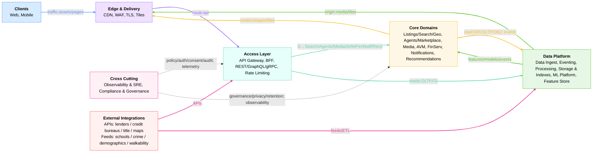
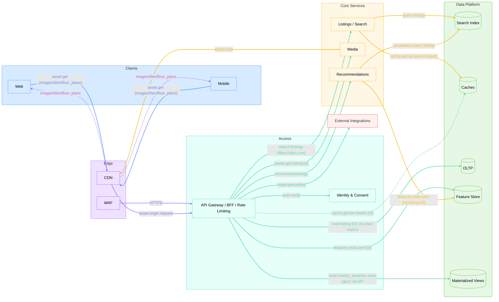
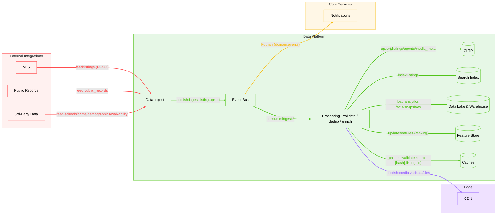
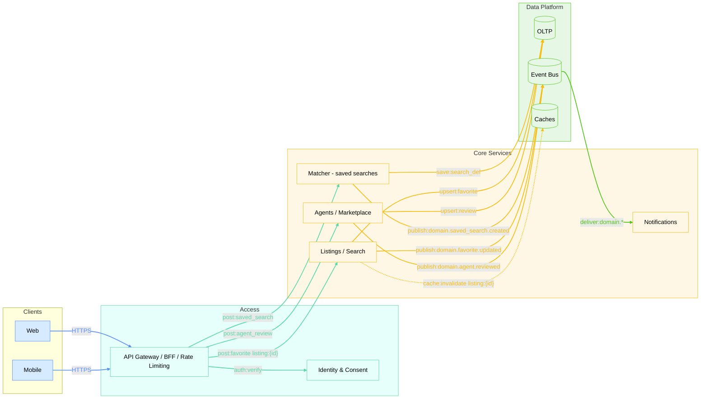
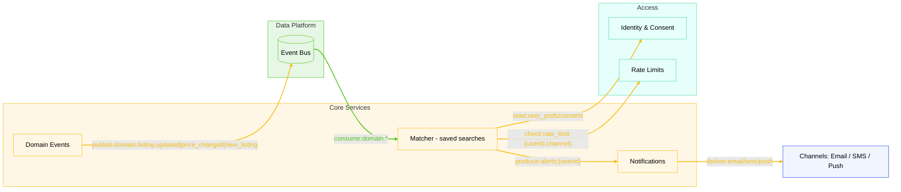
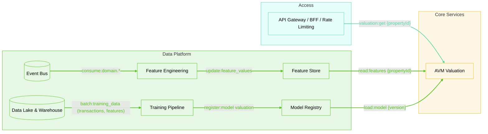

# Архитектура

Этот документ фиксирует верхнеуровневую разбивку на домены и явное соответствие требованиям из task.md.

## Домены

### Edge & Delivery (CDN/WAF/TLS/статик/тайлы)
- Контекст: быстрая доставка на краю, защита периметра, offload бэкенда.
- Связи: Клиенты → Edge → Gateway; медиа: Object Storage → CDN.
- Справка: [CDN](glossary-ru.md#edge--delivery), [WAF](glossary-ru.md#edge--delivery), [TLS](glossary-ru.md#edge--delivery)
- Покрывает:
  - [Non‑Functional — Performance](task.md#performance)
  - [Non‑Functional — Scale](task.md#scale)
  - [Non‑Functional — Reliability & Compliance](task.md#reliability--compliance)
  - [Key Design Challenges](task.md#key-design-challenges)

### Access Layer (API Gateway/BFF/GraphQL/Rate Limiting)
- Контекст: единая точка входа, маршрутизация/агрегация, кеши, канареечные релизы, rate limiting (per-user/per-IP/per-API).
- Связи: Edge → Gateway → Core; интеграции с Auth/Consent/SRE.
- Справка: [API Gateway](glossary-ru.md#access-layer), [BFF](glossary-ru.md#access-layer), [GraphQL](glossary-ru.md#access-layer), [Rate Limiting](glossary-ru.md#access-layer)
- Примечание: GraphQL опционален; можно обойтись агрегирующими REST эндпоинтами в BFF — выбор зависит от вариативности UI и зрелости команды.
- Покрывает:
  - [Functional — Core Platform Features](task.md#core-platform-features)
  - [Non‑Functional — Performance](task.md#performance)
  - [Non‑Functional — Reliability & Compliance](task.md#reliability--compliance)
  - [Non‑Functional — Scale](task.md#scale)

### Identity & Consent (AuthZ/AuthN, RBAC/ABAC, согласия/приватность)
- Контекст: доступ, защита PII, управление согласиями и предпочтениями.
- Связи: проверки токенов и consent на входе и в доменных сервисах.
- Справка: [OAuth 2.0 / OIDC](glossary-ru.md#identity--privacy), [RBAC/ABAC](glossary-ru.md#identity--privacy), [PII/DSAR/Consent](glossary-ru.md#identity--privacy), [Tokenization](glossary-ru.md#identity--privacy)
- Покрывает:
  - [Non‑Functional — Reliability & Compliance](task.md#reliability--compliance)
  - [Advanced Features](task.md#advanced-features)

### Core Domain — Listings/Search/Geo
- Контекст: фильтры/агрегации/гео‑поиск, выдача результатов и карты.
- Связи: Gateway → Listings / Search / Geo → Index/Caches; инвалидация по событиям.
- Справка: [Geospatial index](glossary-ru.md#geo), [Cache](glossary-ru.md#storage--indexes)
- Покрывает:
  - [Functional — Core Platform Features](task.md#core-platform-features)
  - [Non‑Functional — Performance](task.md#performance)
  - [Non‑Functional — Scale](task.md#scale)
  - [Non‑Functional — Reliability & Compliance](task.md#reliability--compliance)

### Core Domain — Agents/Marketplace
- Контекст: профили, отзывы, история сделок, матчинг клиентов.
- Связи: доступ через Gateway; хранение в OLTP/Index.
- Покрывает:
  - [Functional — Core Platform Features](task.md#core-platform-features)
  - [Non‑Functional — Scale](task.md#scale)
  - [Technical Constraints — Industry](task.md#real-estate-industry-challenges)

### Core Domain — Media (Images/Floor Plans/Virtual Tours/Tiles)
- Контекст: хранение больших медиа (фото, планы этажей), 3D/AR‑туры, генерация тайлов/превью, CDN‑раздача.
- Связи: Object Storage ↔ CDN; доменные сервисы ссылаются на медиа.
- Справка: [Object Storage](glossary-ru.md#storage--indexes), [CDN](glossary-ru.md#edge--delivery), [Tiling/Tiles](glossary-ru.md#geo)
- Покрывает:
  - [Advanced Features](task.md#advanced-features)
  - [Non‑Functional — Performance](task.md#performance)
  - [Non‑Functional — Scale](task.md#scale)

### Core Domain — AVM/Valuation
- Контекст: расчёт стоимости, конфиденс, объяснимость.
- Связи: онлайн‑инференс на ML‑сервисе; тренировка из Data Lake & Warehouse.
- Справка: [AVM](glossary-ru.md#ml--avm), [Feature Store](glossary-ru.md#ml--avm), [Model Registry](glossary-ru.md#ml--avm)
- Покрывает:
  - [Functional — Core Platform Features](task.md#core-platform-features)
  - [Advanced Features](task.md#advanced-features)
  - [Non‑Functional — Performance](task.md#performance)

### Core Domain — Mortgage/FinServ
- Контекст: предодобрение, сравнение ставок (агрегация), заявки; интеграции с кредиторами.
- Связи: через Gateway/External APIs; хранение в OLTP / Data Lake & Warehouse.
- Покрывает:
  - [Functional — Core Platform Features](task.md#core-platform-features)
  - [Data Integration Requirements](task.md#data-integration-requirements)
  - [Non‑Functional — Reliability & Compliance](task.md#reliability--compliance)

### Core Domain — Notifications
- Контекст: сохранённые поиски, триггеры событий, каналы Email/SMS/Push, лимиты.
- Связи: события домена → Notification svc → каналы; prefs/consent.
- Справка: [Event Bus](glossary-ru.md#data-integration--eventing)
- Покрывает:
  - [Advanced Features](task.md#advanced-features)
  - [Non‑Functional — Reliability & Compliance](task.md#reliability--compliance)
  - [Key Design Challenges](task.md#key-design-challenges)

### Core Domain — Recommendations
- Контекст: персонализированные рекомендации объектов, модели ранжирования, матчинг user preferences.
- Связи: запросы через Gateway; фичи из Feature Store, модели из ML Platform; результаты из Search Index.
- Справка: [ML Platform](glossary-ru.md#ml--avm), [Feature Store](glossary-ru.md#ml--avm)
- Покрывает:
  - [Advanced Features](task.md#advanced-features)
  - [Non‑Functional — Performance](task.md#performance)

### Data Ingest
- Контекст: коннекторы MLS/Public Records/3rd‑party (schools/crime/demographics/walkability), нормализация, дедуп.
- Связи: Ingest → Event Bus → Processing → OLTP / Index / Data Lake & Warehouse.
- Справка: [MLS/RESO](glossary-ru.md#data-integration--eventing), [CDC](glossary-ru.md#data-integration--eventing), [Schema Registry](glossary-ru.md#data-integration--eventing), [Outbox](glossary-ru.md#data-integration--eventing)
- Покрывает:
  - [Data Integration Requirements](task.md#data-integration-requirements)
  - [Non‑Functional — Scale](task.md#scale)
  - [Technical Constraints — Data Complexity](task.md#data-complexity)

### Eventing & Streaming
- Контекст: Kafka/PubSub, schema registry, outbox/CDC; шина событий.
- Связи: доменные события → шина → обработка/индексация/алерты.
- Справка: [Event Bus](glossary-ru.md#data-integration--eventing)
- Покрывает:
  - [Key Design Challenges](task.md#key-design-challenges)
  - [Advanced Features](task.md#advanced-features)

### Processing & Orchestration (Stream/Batch)
- Контекст: валидация, дедуп/идемпотентность, enrichment, расчёты, индексация.
- Связи: потребляет шину; пишет в OLTP/Index/DWH/Feature Store.
- Справка: [Streaming/Batch, Idempotency, Dedup, Backpressure, Delivery semantics](glossary-ru.md#processing--orchestration)
- Покрывает:
  - [Non‑Functional — Reliability & Compliance](task.md#reliability--compliance)
  - [Data Integration Requirements](task.md#data-integration-requirements)
  - [Advanced Features](task.md#advanced-features)

### Storage & Indexes (OLTP, Search, Data Lake & Warehouse, Object Storage, Caches)
- Контекст: транзакции, полнотекст/гео‑поиск, аналитика, медиа, кеши.
- Связи: чтение доменом/поиском; запись из Processing; медиа через CDN.
- Справка: [OLTP, Search Index, Data Lake & Warehouse, Object Storage, Cache](glossary-ru.md#storage--indexes)
- Покрывает:
  - [Non‑Functional — Performance](task.md#performance)
  - [Non‑Functional — Scale](task.md#scale)
  - [Advanced Features](task.md#advanced-features)

### ML Platform (Feature Store, Training, Serving, Registry)
- Контекст: оффлайн тренировка, онлайн/батч‑инференс, управление моделями.
- Связи: тренировка из Data Lake & Warehouse; online фичи из стримов; вызовы из Core.
- Справка: [Feature Store, Model Registry, Online/Offline, Retraining/Drift](glossary-ru.md#ml--avm)
- Покрывает:
  - [Advanced Features](task.md#advanced-features)
  - [Non‑Functional — Performance](task.md#performance)

### Observability & SRE
- Контекст: метрики/логи/трейсы, алерты, деградации, автоскейл, capacity/cost.
- Связи: сквозная телеметрия всех слоёв.
- Справка: [SRE, SLI/SLO/SLA, p95/p99, Tracing/Logging/Metrics, Circuit Breaker, Canary](glossary-ru.md#observability--sre)
- Покрывает:
  - [Non‑Functional — Reliability & Compliance](task.md#reliability--compliance)
  - [Non‑Functional — Performance](task.md#performance)
  - [Technical Constraints — Industry](task.md#real-estate-industry-challenges)

### Compliance & Governance (PII‑vault, аудит, ретеншн)
- Контекст: защита PII, токенизация, аудит, ретеншн, consent‑ledger.
- Связи: интеграция с Identity/Consent, применимо ко всем сервисам.
- Справка: [CCPA, TILA‑RESPA, Fair lending, Retention/Legal hold](glossary-ru.md#compliance--governance)
- Покрывает:
  - [Non‑Functional — Reliability & Compliance](task.md#reliability--compliance)
  - [Non‑Functional — Financial Compliance](task.md#reliability--compliance)
  - [Technical Constraints — Industry](task.md#real-estate-industry-challenges)

### External Integrations
- Контекст: lenders/credit bureaus/title companies, карты/геокодинг, 3rd‑party данные (schools/crime/demographics/walkability).
- Связи: через Gateway или интеграционные сервисы; квоты/ретраи.
- Покрывает:
  - [Data Integration Requirements](task.md#data-integration-requirements)
  - [Functional — Core Platform Features](task.md#core-platform-features)
  - [Non‑Functional — Performance](task.md#performance)

## Отчёт покрытия требований

| Требование | Группа требований | Покрывается доменом | Основные механизмы |
|---|---|---|---|
| Property Search | Functional — Core Platform Features | Listings/Search/Geo; Access; Storage & Indexes | Listings / Search / Geo + ES/OpenSearch, кэши, BFF агрегации |
| Property Details | Functional — Core Platform Features | Listings/Search/Geo; Media; Access | чтение OLTP/Index; медиа через CDN |
| Valuation Engine | Functional — Core Platform Features | AVM/Valuation; ML Platform; Access | онлайн‑инференс, фичи из Feature Store |
| Agent Marketplace | Functional — Core Platform Features | Agents/Marketplace; Access | профили/отзывы, поиск агентов |
| Mortgage Integration | Functional — Core Platform Features | Mortgage/FinServ; External Integrations; Access | интеграции с кредиторами, BFF‑флоу |
| MLS Integration | Data Integration Requirements | Data Ingest; Processing; Eventing | коннекторы RESO, нормализация, дедуп |
| Public Records | Data Integration Requirements | Data Ingest; Processing | парсинг/матчинг, загрузка в DWH/OLTP |
| Financial Services | Data Integration Requirements | External Integrations; Mortgage/FinServ | API кредиторов/скоринга, безопасность |
| Third‑Party Data | Data Integration Requirements | Data Ingest; External Integrations | школы/криминал/демография/пешеходная доступность (walkability) |
| Price Prediction | Advanced Features | ML Platform; AVM/Valuation | тренировка в Data Lake & Warehouse, сервинг онлайн |
| Saved Searches & Alerts | Advanced Features | Notifications; Identity & Consent; Eventing | события домена → триггеры; prefs/opt‑in |
| Personalized Recommendations | Advanced Features | Recommendations; ML Platform; Feature Store | ranking models, user prefs, Feature Store фичи |
| Virtual Tours | Advanced Features | Media; Storage & Indexes; Edge | 3D/AR‑модели, drone footage, объектное хранилище, CDN, генерация превью |
| Market Analytics | Advanced Features | Processing; Data Lake & Warehouse | витрины/кубы: inventory, DOM (days‑on‑market); отчёты |
| Users: 100M MAU | Non‑Functional — Scale | Edge; Access; SRE | CDN, горизонтальный скейл, rate limiting |
| Properties: 200M | Non‑Functional — Scale | Storage & Indexes; Search | шардинг/партиционирование, инверт. индекс |
| Agents: 2M | Non‑Functional — Scale | Agents/Marketplace; Storage | индексы/кэш профилей |
| Data Updates: 1M/day | Non‑Functional — Scale | Data Ingest; Eventing; Processing | Kafka, stream/batch, идемпотентность |
| Search p95 <200ms | Non‑Functional — Performance | Access; Listings/Search/Geo; Storage & Indexes | кэши, ES, pre‑agg, CQRS |
| Map <300ms (1000+ pins) | Non‑Functional — Performance | Listings/Search/Geo; Edge; External Integrations | тайлы/CDN, гео‑индексы, кластеризация |
| Image <1s | Non‑Functional — Performance | Media; Edge; Storage & Indexes | CDN, варианты изображений, кеш |
| Valuation <5s | Non‑Functional — Performance | AVM/Valuation; ML Platform | онлайн‑сервинг, кэш результатов |
| Availability 99.95% | Non‑Functional — Reliability & Compliance | SRE; Edge; Access | мультизона, health checks, авто‑ремедиация |
| Data Accuracy 99.9% | Non‑Functional — Reliability & Compliance | Data Ingest; Processing; Governance | валидации, дедуп, аудит |
| Privacy (CCPA/state) | Non‑Functional — Reliability & Compliance | Identity & Consent; Governance | consent‑ledger, PII‑vault |
| Real‑estate disclosures | Non‑Functional — Reliability & Compliance | Governance; Access | аудит/ретеншн, контроль выдачи |
| TILA‑RESPA, fair lending | Non‑Functional — Reliability & Compliance | Mortgage/FinServ; Governance | политики кредитования, аудит |
| MLS Variations | Technical Constraints — Data Complexity | Data Ingest; Processing | маппинг RESO, нормализация |
| Data Quality | Technical Constraints — Data Complexity | Data Ingest; Processing; Governance | правила качества, идемпотентность |
| Historical Data 30+y | Technical Constraints — Data Complexity | Storage & Indexes; Data Lake & Warehouse | партиции, колонночные форматы |
| Geographic Coverage | Technical Constraints — Data Complexity | Listings/Search/Geo; External Integrations | геосервисы, geo‑индексы |
| Agent Relationships | Technical Constraints — Industry | Agents/Marketplace; Governance | матрицы ролей, доступы |
| Legal Requirements | Technical Constraints — Industry | Governance; Identity & Consent | комплаенс, аудит |
| Market Sensitivity | Technical Constraints — Industry | ML Platform; Processing | фичи рынка, retraining |
| Seasonal Patterns | Technical Constraints — Industry | SRE; Edge; Access | автоскейл, лимиты, кеши |
| Build vs Buy | Key Design Challenges | Edge; Eventing; Storage; ML Platform | managed Kafka/ES/CDN, облачные сервисы |
| Data Architecture | Key Design Challenges | Data Ingest; Processing; Storage & Indexes | лейк+DWH, CQRS, стриминг |
| Event‑Driven Architecture | Key Design Challenges | Eventing & Streaming; Notifications | шина, outbox/CDC, триггеры |

## Design rationale & trade-offs

- Access Layer — API Gateway/BFF + API моделирование (GraphQL/REST/gRPC) + Rate Limiting
  - Проблема: у нас много экранов и клиентов (Web/Mobile). Каждый экран хочет сразу «готовую» сборку данных из разных доменов (листинги, медиа, AVM, ипотека). Прямые вызовы из клиента множатся, растёт чатовость, страница дольше грузится, сложнее контролировать перегрузку бэкендов.
  - Как это выглядит для пользователя: один запрос на экран → быстрый ответ без «мелькания» и догрузок; стабильное поведение при пиках.
  - Как это выглядит для команд: фронт запрашивает ровно те поля, что нужны (GraphQL) или бьёт по агрегирующим REST/gRPC эндпоинтам; BFF собирает ответ из доменов и кэширует; гейтвей ставит лимиты, фичфлаги, канареечные релизы, авторизацию/консенты.
  - Почему не «клиент → домены напрямую»: чатовость N→M, дублирование агрегаций во фронтах, сложнее управлять SLA и безопасностью.
  - Почему не «mesh‑композиция внизу»: сложно отладить и контролировать продуктовые агрегации, выше риск «невидимых» зависимостей.
  - Что получаем: ниже TTFB за счёт агрегаций/кэшей, единые политики доступа и rate limiting, независимая эволюция фронтов и доменов.
  - Не взаимоисключимо с хранилищами: read‑реплики OLTP и materialized views живут на Storage/Indexes уровне и дополняют BFF, а не заменяют его.
  - Примечание: GraphQL опционален — ту же агрегацию можно реализовать агрегирующими REST эндпоинтами в BFF; используем GraphQL там, где нужна гибкость выборки полей и быстрые изменения схем.
  - Риски/минусы: центральный слой может стать «бутылочным горлышком», требуется дисциплина схем/версий; соблазн «перетащить бизнес‑логику» в BFF.
  - Как снижаем риски: горизонтальный скейл G/BFF, лимиты/таймауты/CB, schema‑linting и контрактные тесты, федерация/модуляризация схем, SLO/алерты.
  - Требования: Performance, Scale, Reliability (task.md)
  - Когда пересматривать: если продукту достаточно простого REST без агрегаций и строгого контроля на периметре.

- Event‑driven ядро — Event Bus + Outbox/CDC
  - Проблема: декуплинг доменов и масштаб инкрементальных обновлений
  - Альтернативы: синхронные RPC/оркестраторы, cron/batch только
  - Решение: доменные события, outbox/CDC, соглашения схем
  - Плюсы: масштабируемость ingest/индексаций/уведомлений, backpressure/ретраи
  - Минусы: сложнее трассировка и семантика доставки (at‑least/exactly‑once)
  - Требования: Data Integration, EDA (Key Design Challenges)
  - Когда пересматривать: если требований real‑time нет и достаточно ежедневных batch

- CQRS/Индексы + многоуровневые кеши
  - Проблема: p95 <200ms поиск/карта при большом объёме данных
  - Альтернативы: только OLTP; один универсальный стор без денормализации
  - Решение: write‑path → OLTP/DWH, read‑path → индексы/кэши, явные инвалидации
  - Техники: read‑replicas OLTP для горячих чтений; materialized views под сценарии; precompute агрегатов; TTL/partial caching
  - Плюсы: низкая латентность, эластичность, контролируемые инвалидации
  - Минусы: eventual consistency, сложность поддержки кэшей
  - Требования: Performance, Scale
  - Когда пересматривать: если объем/латентность не критичны и важнее строгая консистентность

- Data Lake & Warehouse
  - Проблема: исторические 30+ лет, разнородные источники и аналитика/ML
  - Альтернативы: только OLTP и операционные витрины
  - Решение: lake + DWH как единая платформа аналитики/ML
  - Плюсы: дешёвое хранение, гибкие пайплайны, reproducibility
  - Минусы: batch‑задержки, управление качеством/схемами
  - Требования: Data Complexity, Advanced Features
  - Когда пересматривать: если объемы малы и хватает OLTP/материализованных представлений

- ML Platform + Feature Store
  - Проблема: согласованные фичи online/offline, версия моделей, дрейф
  - Альтернативы: локальные фичи в сервисах, без централизованного сервинга
  - Решение: Feature Store, модельный реестр, online‑serving
  - Плюсы: повторяемость, низкая латентность AVM/reco, быстрая переобучаемость
  - Минусы: стоимость владения, MLOps процессы
  - Требования: Advanced Features (AVM, Recommendations)
  - Когда пересматривать: если ML ограничен оффлайн‑отчетами

- External Integrations — отдельный домен
  - Проблема: внешние провайдеры (lenders/credit bureaus/title companies/maps/schools/crime/demographics/walkability) с разными SLA/квотами
  - Альтернативы: инкапсулировать в Core/Access
  - Решение: изоляция интеграций, явные контракты, квоты/ретраи/бэк‑офф
  - Плюсы: чёткие границы, контроль SLA, независимая эволюция
  - Минусы: доп. маршрутизация/мониторинг
  - Требования: Data Integration, Mortgage/FinServ
  - Когда пересматривать: если интеграции исчезающе малы и стабильны

- Сквозные домены — Identity & Consent, Governance, Observability
  - Роль: политика доступа/приватности/ретеншн и телеметрия сквозь все домены
  - Решение: политики/SDK/sidecar/агенты вместо синхронных бизнес‑вызовов
  - Плюсы: единые правила и метрики, SLO/SLA контроль, трассировка end‑to‑end
  - Минусы: операционная сложность, дисциплина внедрения
  - Требования: Reliability & Compliance
  - Когда пересматривать: если регуляторика ослаблена и достаточно локальных политик

## Обзор архитектуры

## Детализация

```mermaid
flowchart LR
  subgraph CSG [<b>Clients</b>]
    direction TB
    WEB[Web]
    MOB[Mobile]
  end

  subgraph EG [<b>Edge & Delivery</b>]
    direction TB
    WAF[WAF]
    CDN[CDN]
  end

  subgraph ACC [<b>Access Layer</b>]
    direction TB
    G[API Gateway / BFF / Rate Limiting]
    AUTH[Identity & Consent]
  end

  subgraph CORE [<b>Core Services</b>]
    direction LR
    SRCH[Listings / Search ]
    AG[Agents / Marketplace]
    MED[Media]
    AVM[AVM / Valuation]
    FIN[Mortgage / FinServ]
    NOTIF[Notifications]
    RECO[Recommendations]
  end

  subgraph DP [<b>Data Platform</b>]
    direction LR
    IN[Data Ingest]
    BUS[Event Bus]
    PROC[Processing]
    OLTP[(OLTP)]
    IDX[(Search Index)]
    DWH[(Data Lake & Warehouse)]
    OBJ[(Object Storage)]
    CACHE[(Caches)]
    ML[ML Platform]
    FS[(Feature Store)]
  end

  subgraph XCT [<b>Cross Cutting</b>]
    direction TB
    OBS[Observability & SRE]
    GOV[Compliance & Governance]
  end

  EXT[<b>External Integrations</b><br>APIs: lenders / credit bureaus / title / maps<br>Feeds: schools / crime / demographics / walkability]

  WEB -- asset:get --> CDN
  MOB -- asset:get --> CDN
  CDN -- request:api/page --> G
  WAF -- shield:filter --> G
  G -- auth:verify --> AUTH
  G -- search:listings --> SRCH
  G -- get:agents --> AG
  G -- media:meta --> MED
  G -- valuation:get --> AVM
  G -- mortgage:rates|preapproval|apply --> FIN
  G -- alerts:manage --> NOTIF
  G -- recommend:listings --> RECO

  IN -- publish:ingest.* --> BUS --> PROC
  PROC -- upsert:entities --> OLTP
  PROC -- index:listings --> IDX
  PROC -- load:analytics --> DWH
  MED -- media:store --> OBJ
  OBJ -- media:distribute --> CDN
  SRCH -- query:index --> IDX
  AG -- rw:agents --> OLTP
  FIN -- rw:loan_apps --> OLTP
  NOTIF -- deliver:email|sms|push --> CH[Channels: Email / SMS / Push]

  OBS -. telemetry .-> G
  OBS -. telemetry .-> SRCH
  GOV -. policy/audit .-> G
  GOV -. compliance .-> FIN
  EXT -- APIs:maps --> G
  EXT -- APIs:lenders --> FIN
  EXT -- APIs:credit_checks --> FIN
  EXT -- APIs:title_orders --> FIN
  EXT -- Feeds:schools --> IN
  EXT -- Feeds:crime/demographics/walkability --> IN

  class WEB,MOB clients;
  class WAF,CDN edge;
  class G,AUTH access;
  class SRCH,AG,MED,AVM,FIN,NOTIF,RECO core;
  class IN,BUS,PROC,OLTP,IDX,DWH,OBJ,CACHE,ML,FS platform;
  class OBS,GOV cross;
  class EXT external;
  class CH channel;

  style CSG fill:#D6EBFF,stroke:#5B8FF9,stroke-width:1px,color:#333
  style EG fill:#EFE1FF,stroke:#9A6AFF,stroke-width:1px,color:#333
  style ACC fill:#E6FFFB,stroke:#5AD8A6,stroke-width:1px,color:#333
  style CORE fill:#FFF7E6,stroke:#F6BD16,stroke-width:1px,color:#333
  style DP fill:#E6F7E6,stroke:#52C41A,stroke-width:1px,color:#333
  style XCT fill:#FFF0F6,stroke:#EB2F96,stroke-width:1px,color:#333
  style EXT fill:#FFF1F0,stroke:#FF4D4F,stroke-width:1px,color:#333

  classDef clients fill:#D6EBFF,stroke:#5B8FF9,color:#000,stroke-width:1px;
  classDef edge fill:#EFE1FF,stroke:#9A6AFF,color:#000,stroke-width:1px;
  classDef access fill:#E6FFFB,stroke:#5AD8A6,color:#000,stroke-width:1px;
  classDef core fill:#FFF7E6,stroke:#F6BD16,color:#000,stroke-width:1px;
  classDef platform fill:#E6F7E6,stroke:#52C41A,color:#000,stroke-width:1px;
  classDef cross fill:#FFF0F6,stroke:#EB2F96,color:#000,stroke-width:1px;
  classDef external fill:#FFF1F0,stroke:#FF4D4F,color:#000,stroke-width:1px;
  classDef channel fill:#F0F5FF,stroke:#2F54EB,color:#000,stroke-width:1px;

  linkStyle 0 stroke:#5B8FF9,color:#5B8FF9,stroke-width:2px
  linkStyle 1 stroke:#5B8FF9,color:#5B8FF9,stroke-width:2px
  linkStyle 2 stroke:#9A6AFF,color:#9A6AFF,stroke-width:2px
  linkStyle 3 stroke:#9A6AFF,color:#9A6AFF,stroke-width:2px
  linkStyle 4 stroke:#5AD8A6,color:#5AD8A6,stroke-width:2px
  linkStyle 5 stroke:#5AD8A6,color:#5AD8A6,stroke-width:2px
  linkStyle 6 stroke:#5AD8A6,color:#5AD8A6,stroke-width:2px
  linkStyle 7 stroke:#5AD8A6,color:#5AD8A6,stroke-width:2px
  linkStyle 8 stroke:#5AD8A6,color:#5AD8A6,stroke-width:2px
  linkStyle 9 stroke:#5AD8A6,color:#5AD8A6,stroke-width:2px
  linkStyle 10 stroke:#5AD8A6,color:#5AD8A6,stroke-width:2px
  linkStyle 11 stroke:#5AD8A6,color:#5AD8A6,stroke-width:2px
  linkStyle 12 stroke:#52C41A,color:#52C41A,stroke-width:2px
  linkStyle 13 stroke:#52C41A,color:#52C41A,stroke-width:2px
  linkStyle 14 stroke:#52C41A,color:#52C41A,stroke-width:2px
  linkStyle 15 stroke:#52C41A,color:#52C41A,stroke-width:2px
  linkStyle 16 stroke:#52C41A,color:#52C41A,stroke-width:2px
  linkStyle 17 stroke:#F6BD16,color:#F6BD16,stroke-width:2px
  linkStyle 18 stroke:#52C41A,color:#52C41A,stroke-width:2px
  linkStyle 19 stroke:#F6BD16,color:#F6BD16,stroke-width:2px
  linkStyle 20 stroke:#F6BD16,color:#F6BD16,stroke-width:2px
  linkStyle 21 stroke:#F6BD16,color:#F6BD16,stroke-width:2px
  linkStyle 22 stroke:#F6BD16,color:#F6BD16,stroke-width:2px
  linkStyle 23 stroke:#EB2F96,color:#EB2F96,stroke-width:2px
  linkStyle 24 stroke:#EB2F96,color:#EB2F96,stroke-width:2px
  linkStyle 25 stroke:#EB2F96,color:#EB2F96,stroke-width:2px
  linkStyle 26 stroke:#EB2F96,color:#EB2F96,stroke-width:2px
  linkStyle 27 stroke:#FF4D4F,color:#FF4D4F,stroke-width:2px
  linkStyle 28 stroke:#FF4D4F,color:#FF4D4F,stroke-width:2px
  linkStyle 29 stroke:#FF4D4F,color:#FF4D4F,stroke-width:2px
  linkStyle 30 stroke:#FF4D4F,color:#FF4D4F,stroke-width:2px
  linkStyle 31 stroke:#FF4D4F,color:#FF4D4F,stroke-width:2px
  linkStyle 32 stroke:#FF4D4F,color:#FF4D4F,stroke-width:2px

  PROC -. cache:invalidate|prime .-> CACHE
  SRCH -. cache:get|set .-> CACHE
  G -. read:entities .-> OLTP
  DWH -- train:batch --> ML
  ML -- serve:model --> AVM
  BUS -- publish:domain.events --> NOTIF
  PROC -- features:update --> FS
  G -- features:get --> FS
  FS -- features:read --> AVM

  RECO -- features:read --> FS
  RECO -- query:candidates --> IDX

  %% Colorize new links
  linkStyle 33 stroke:#52C41A,color:#52C41A,stroke-width:2px
  linkStyle 34 stroke:#F6BD16,color:#F6BD16,stroke-width:2px
  linkStyle 35 stroke:#5AD8A6,color:#5AD8A6,stroke-width:2px
  linkStyle 36 stroke:#52C41A,color:#52C41A,stroke-width:2px
  linkStyle 37 stroke:#52C41A,color:#52C41A,stroke-width:2px
  linkStyle 38 stroke:#52C41A,color:#52C41A,stroke-width:2px
  linkStyle 39 stroke:#52C41A,color:#52C41A,stroke-width:2px
  linkStyle 40 stroke:#5AD8A6,color:#5AD8A6,stroke-width:2px
  linkStyle 41 stroke:#52C41A,color:#52C41A,stroke-width:2px
  linkStyle 42 stroke:#F6BD16,color:#F6BD16,stroke-width:2px
  linkStyle 43 stroke:#F6BD16,color:#F6BD16,stroke-width:2px
  WEB -- https:api --> WAF
  MOB -- https:api --> WAF

  linkStyle 44 stroke:#5B8FF9,color:#5B8FF9,stroke-width:2px
  linkStyle 45 stroke:#5B8FF9,color:#5B8FF9,stroke-width:2px
```

#### Почему так (bird’s‑eye)

- Разделили на домены, чтобы команды работали независимо и не «ломали» друг друга. Контракты между доменами простые и явные.
- Весь внешний трафик идёт через Access: там проверяем доступ/согласия, режем «шум» запросов, объединяем ответы для экранов, ставим лимиты и кэш.
- Между доменами — события: изменения «разлетаются» без синхронных блокировок. Индексация/уведомления реагируют на них.
- Для быстрых чтений используем индексы и кэши, для записей/истории — OLTP и витрины в Lake/DWH. Так достигаем и скорость, и полноту данных.
- Интеграции вынесены отдельно: у каждого провайдера свои SLA/квоты/ошибки — проще мониторить и не тянуть риски в ядро.
- Сквозные домены (наблюдаемость/комплаенс) не «дергают» сервисы напрямую, а настраивают политику и телеметрию поверх — получается прозрачность без хрупких связей.

## Data Flows

### Read Path — Search & Map + Property Details (interactive)

- Targets: Functional — Property Details, Non‑Functional — Performance, Non‑Functional — Scale, Non‑Functional — Reliability & Compliance
- Notes: кэш/преагрегации на BFF, гео‑индексы, тайлы через CDN; материализованные представления под локальную аналитику; деградации при пиках

#### Почему так (Read Path — Search & Map + Property Details)
- Цель — «живой» поиск/карта и быстрая карточка объекта: список/пины и детали появляются быстро, данные актуальны.
- Запросы читают из поискового индекса (быстро) и кэшей; карточки/детали добираем из OLTP при необходимости — баланс скорости и свежести.
- Neighborhood/market analytics для карточки читаем из MV — быстрые витрины без нагрузки на OLTP.
- Инвалидации приходят по событиям: как только обновилась запись/индекс — кэш очищается, результаты не «протухают».
- Картинки/тайлы идут через CDN, поэтому лента и карта грузятся плавно даже при пиках.
- Онлайн‑фичи/рекомендации подключаем к запросу — персонализация без отдельного «маршрута».
- На входе проверяем авторизацию и согласия — это влияет на видимость данных и персональные блоки.

### Write Path — Ingest, Processing, Indexing

- Targets: Data Integration Requirements, Technical Constraints — Data Complexity, Non‑Functional — Scale, Non‑Functional — Reliability & Compliance
- Notes: идемпотентность/outbox, дедуп, схемы, SLA индексации и инвалидаций

#### Почему так (Write Path — Ingest/Processing)
- Нужны стабильные ежедневные 1M+ обновлений без дублей и «ломания» фронта.
- Outbox/CDC и шина обеспечивают доставку и повторные попытки — система не «роняет» обновления при сбоях.
- Идемпотентность и дедуп гарантируют, что запись не попадёт в индексы дважды, а состояние будет корректным.
- ETL складывает «сырые» и агрегированные данные в Lake/DWH — оттуда питаются отчёты и обучение моделей.
- Индексация батчами + целевые инвалидации кэша дают быстрый путь чтения без долгих пересборок.

### User Actions — Saved Searches / Favorites / Reviews

- Targets: Functional — Saved Searches, Favorites, Reviews; Non‑Functional — Reliability
- Notes: сохранённые поиски и избранное пишутся в OLTP; события домена запускают триггеры уведомлений; ревью агентов учитывают комплаенс/модерацию.

### Notifications — Saved Searches & Alerts

- Targets: Advanced Features, Non‑Functional — Reliability & Compliance, Key Design Challenges
- Notes: opt‑in/opt‑out, per‑user/пер‑канальные лимиты, ретраи и дедуп отправок

#### Почему так (Notifications)
- События домена запускают рассылки — сервисы не держат друг друга «на коротком поводке».
- Отдельный матчинг по сохранённым запросам масштабируется независимо от отправки писем/SMS.
- Настройки пользователя и согласия учитываются по умолчанию; лимиты не дают спамить и держат издержки под контролем.
- Каналы (email/SMS/push) абстрагированы — можно добавлять новые без переделки ядра.

### AVM / ML — Training & Online Serving

- Targets: Advanced Features, Non‑Functional — Performance
- Notes: offline тренировка из DWH, online фичи из стримов; latency AVM <5s

#### Почему так (AVM/ML)
- Нужно быстро считать оценку дома (<5s) и при этом регулярно переобучать модели.
- Feature Store даёт единые фичи для обучения и для онлайна — результаты сопоставимы и предсказуемы.
- Реестр моделей хранит версии и артефакты — легко откатиться или сравнить качество.
- Онлайн‑сервинг минимизирует задержку ответа, не нагружая основную базу.
- Переобучение из DWH/стримов позволяет подстраиваться под рынок и ловить дрейф.

## SLA/SLO, отказоустойчивость и деградации

### SLO бюджеты по слоям (p95, ориентиры)

| Слой | Бюджет латентности p95 |
|---|---|
| Edge/CDN | ≤ 30–50 мс (TLS/WAF/кеш) |
| API Gateway/BFF (роутинг) | ≤ 20–30 мс |
| BFF (агрегация) | ≤ 60–80 мс |
| Search Index (запрос) | ≤ 120–150 мс |
| OLTP (read‑replica, точечные чтения) | ≤ 30–50 мс |
| Feature Store (онлайн KV) | ≤ 20–30 мс |
| Media (CDN отдача) | ≤ 50–100 мс до первого байта |

Целевые hit‑rate: BFF‑кеш ≥ 70%, CDN (тайлы/изображения) ≥ 90% в пике. Инвалидации — событиементные, селективные.

### RTO/RPO и фейловер

- OLTP (критичный путь чтения/записи): RTO ≤ 15 мин, RPO ≤ 5 мин (реплики/снапшоты/WAL, автоматический фейловер в зоне).
- Search/Index: RTO ≤ 60 мин, RPO ≤ 15 мин (переиндексация частями, shard‑promotion).
- Notifications: RTO ≤ 60 мин, RPO ≤ 0 (очереди/повторные попытки обеспечивают доставку после восстановления).
- Data Lake/DWH: RTO ≤ 24 ч, RPO ≤ 1 ч (batch графики допустимы).
- Multi‑AZ обязательно; multi‑region — как следующий шаг (out of scope), с geo‑прогревом CDN и read‑local стратегиями.

### Деградации и фоллбэки

- Карта: снижение плотности пинов/кластеризация, статические тайлы при пике.
- Внешние API (карты/кредиторы): фоллбэк на кэш/предыдущие результаты; graceful отказ UI‑блоков.
- Рекомендации/AVM: временный кэш результатов/пороговая отсечка запроса фич.
- Уведомления: понижение частоты/батчинг, очереди с бэк‑оффом, DLQ.

## Альтернативы и почему не выбрали

- Единый HTAP/универсальный стор (LSM/columnar‑гибрид):
  - Почему нет: усложнение операционки и тюнинга под разнотипные нагрузки, риск смешения SLA онлайна и аналитики; дороже держать SLO p95 <200 мс на mix‑нагрузке.
  - Выбранный путь: OLTP + индексы/кэши (CQRS) для чтений, Lake/DWH для аналитики/ML.
- «GraphQL обязательно»: оставили как опцию — для многих экранов достаточно агрегирующих REST/gRPC эндпоинтов в BFF.
- Тяжёлая оркестрация вместо событий: повышает связанность и задержки; темы/события дают масштабируемость ingest/индексаций/уведомлений.

## Fairness/Interpretability для AVM/Recommendations

- Принципы: отсутствие дискриминации, объяснимость факторов/влияний, аудит версий моделей.
- Практики: мониторинг дрейфа и качества, логирование фич/решений, ограничения применения и дисклеймеры, периодические ревью.

## Интеграции и контрактное тестирование

- Внутренние и внешние API: consumer‑driven contract testing (например, Pact) в CI, чтобы зафиксировать ожидания клиентов и сократить регрессы при релизах.
- События: схемы в Schema Registry, статическая проверка совместимости (backward/forward), линтинг и контрактные тесты на продьюсеров/консьюмеров.
- Релизы: canary/blue‑green, circuit breaker, таймауты/ретраи; наблюдаемость — трассировки/метрики/логи (OpenTelemetry).

## Технологический стек и Build vs Buy

### Слои и варианты

| Слой | Buy (managed/SaaS) | Build (OSS/self‑managed) | Рекомендация |
|---|---|---|---|
| Edge/CDN | CloudFront, Fastly, Akamai | Nginx+Varnish | Buy: глобальный edge и TLS/WAF из коробки |
| WAF/TLS | AWS WAF/Shield, Cloudflare | ModSecurity/Nginx | Buy: скорость и правила |
| API Gateway | AWS API GW, Apigee, Kong Cloud | Envoy/Kong OSS, Nginx | Buy/Hybrid: GW managed + свой BFF |
| BFF (Access) | Cloud Run/Lambda (хостинг) | Node.js/Go на k8s | Build: продуктовая агрегация у нас |
| Identity | Auth0/Okta/Cognito | Keycloak | Buy/Hybrid: внешняя аутентика + свой consent |
| Event Bus | Confluent Cloud/MSK, GCP Pub/Sub | Kafka on k8s | Buy: тяжёлая операционка у провайдера |
| Schema Registry | Confluent SR (managed) | cp‑schema‑registry | Buy |
| Stream/Batch Proc. | KDA/Flink, Dataflow/Beam, EMR/Spark | Flink/Spark on k8s | Buy‑first, Build где нужны тонкие настройки |
| OLTP | Aurora PG/MySQL, Cloud SQL | Postgres | Buy: реплики/бэкапы/HA |
| Search | AWS OpenSearch, Elastic Cloud | Elasticsearch | Buy |
| Cache | ElastiCache/Memorystore | Redis | Buy |
| Object Storage | S3/GCS | MinIO | Buy |
| Lake/DWH | S3+Athena/Redshift, GCS+BigQuery, Snowflake | Hive/Presto/ClickHouse | Buy: BigQuery/Snowflake или Redshift |
| Feature Store | Tecton, SageMaker FS | Feast (+ Redis) | Hybrid: Feast + managed KV |
| ML Platform | SageMaker, Vertex AI | MLflow + KFServing | Buy‑first, MLflow как glue |
| Observability | Datadog/New Relic/Grafana Cloud | Prometheus/Grafana/Loki/Tempo | Начать с managed, затем гибрид |
| Notifications (channels) | SendGrid, Twilio, SES/SNS | — | Buy для каналов; Build для match/правил |
| Maps/Geo | Google Maps, Mapbox | Nominatim/Tile38 | Buy |

Примечания:
- Access: GraphQL опционален; REST/gRPC + BFF покрывают агрегации. Rate limiting — на GW/edge.
- OLTP: используем read‑реплики; сценарные витрины — materialized views.
- Search: гео‑индекс и фасеты — в managed ES/OpenSearch.
- ML: оффлайн — DWH, онлайн — Feature Store + низколатентный KV.

### Референс‑комбинации стека

- AWS (managed‑first):
  - Edge/WAF: CloudFront + AWS WAF
  - Access: API Gateway/ALB + BFF (Node.js TypeScript — NestJS/Fastify, k8s/ECS/Fargate)
  - Eventing: MSK (Kafka) или Confluent Cloud; Schema Registry (Confluent)
  - Processing: Kinesis/KDA (Flink) или MSK + Flink, EMR/Spark batch
  - Storage & Indexes: Aurora Postgres (read replicas, MV), OpenSearch Service, ElastiCache Redis, S3 + Athena/Redshift
  - ML: SageMaker (+ Feature Store) или Feast(+Redis)
  - Observability: CloudWatch + Datadog
  - Notifications: SES + Twilio/FCM/APNS; Maps: Mapbox/Google Maps

- GCP (managed‑first):
  - Edge/WAF: Cloud CDN + Cloud Armor
  - Access: API Gateway/Apigee + BFF (Node.js TypeScript — NestJS/Fastify) на Cloud Run/GKE
  - Eventing: Pub/Sub; Schema (Confluent SR managed)
  - Processing: Dataflow/Beam (stream/batch)
  - Storage & Indexes: Cloud SQL Postgres (реплики, MV), Elastic Cloud/OpenSearch, Memorystore Redis, GCS + BigQuery
  - ML: Vertex AI; Feature Store — Feast(+Redis) или Vertex FS
  - Observability: Cloud Monitoring/Logging + Datadog
  - Notifications: SendGrid/Twilio; Maps: Google Maps

- Lean MVP (быстрый старт 1‑регион):
  - BFF и сервисы на Node.js (TS) в Cloud Run/Lambda; Pub/Sub или Confluent Cloud; Cloud SQL/Aurora; Elastic Cloud; Managed Redis; S3/GCS + BigQuery/Athena; SendGrid/Twilio; Mapbox.
  - Позже: добавить read‑реплики, MV, прогрев кэшей/тайлов, вынести Flink‑пайплайны.

- Scale 100M MAU (эволюция):
  - Мультизона/мультирегион на edge; Confluent Cloud (multi‑AZ), индексы с шардингом, Redis кластер, реплики OLTP; кэширование на BFF/edge; лимиты/деградации.

### Endgame‑style указатель стека (Node.js + Kafka)

- Runtime: Node.js (TypeScript) микросервисы (NestJS/Fastify), REST/gRPC.
- Event Bus: Kafka (Confluent Cloud/MSK), Schema Registry; outbox/CDC, идемпотентность, ретраи с backoff, DLQ.
- Хранилища: Postgres (Aurora/Cloud SQL) с read‑репликами и MV; OpenSearch; Redis; Object Storage + Lake/DWH.
- Оркестрация: k8s/ECS/Cloud Run; CI/CD, canary, circuit breaker; OpenTelemetry.

#### Почему этот стек здесь (баланс «под компанию» vs принципы)
- Экспертиза команды/кандидата (скорость доставки) и зрелая экосистема Node.js/TypeScript.
- Kafka ровно там, где нужна декупляция/фан‑аут и устойчивость к сбоям; синхронные REST/gRPC — где нужна строгая синхронизация и простота.
- Managed‑first снижает оперриски; «строим своё» в дифференцирующих областях (ingest/качество MLS, matching уведомлений, BFF‑агрегации).
- Не догма: стек меняется при изменении ограничений (см. альтернативы и «варианты при ограниченном бюджете» ниже).

#### Guardrails (Simplicity‑first/KISS)
- Старт: синхронные REST/gRPC, batch‑пайплайны, минимальный набор сервисов.
- Kafka/streaming добавляем, когда появляется потребность в декупляции/реактивности/фан‑ауте.
- Границы модулей держим явными, чтобы при росте перейти по пути Strangler Fig к микросервисам.

### Build vs Buy — что строим, что покупаем

- Строим:
  - MLS/Public Records коннекторы, нормализация/дедуп (качество данных — дифференциатор)
  - Notifications Matcher/Rules (бизнес‑логика алертов и частот)
  - BFF (продуктовые агрегации для экранов)

- Покупаем/managed:
  - Kafka/шина, Search, CDN/Edge, Object Storage, Redis, DWH/BigQuery/Snowflake
  - Каналы уведомлений (email/SMS/push), Maps/Geocoding, observability‑platform

- Гибрид:
  - Feature Store (Feast + managed KV), Identity (Auth0/Okta + собственный consent/PII‑процессы)

Критерии выбора:
- SLA/операционные риски > экономия — покупаем managed.
- Дифференциация/скорость изменений — строим.
- Стоимость и lock‑in — допускаем гибрид/абстракцию интерфейсов.

### Варианты стека при ограниченном бюджете/ограничениях

- Low‑cost managed (serverless‑first, 1 регион):
  - Access: API GW/ALB + BFF на Cloud Run/Lambda/Fargate (autoscale, pay‑per‑use)
  - Eventing: Pub/Sub/Kinesis (без Confluent), начать с минимального числа топиков
  - Processing: Dataflow/Beam или периодические Cloud Functions/Batch вместо постоянных кластеров
  - Storage: Cloud SQL/Aurora (малые инстансы + read‑replica позже), Elastic Cloud (минимальный tier), Managed Redis (минимальный shard)
  - Analytics: BigQuery/Athena pay‑per‑query, без постоянных DWH кластеров
  - Media/Edge: CDN+Object Storage (S3/GCS) как есть, без собственного tile‑render farm

- OSS‑first (ограничения на lock‑in):
  - k8s (1‑3 ноды) + Postgres (реплика позже), OpenSearch OSS, Redis OSS, MinIO
  - Streaming по необходимости: Kafka (1 AZ), Schema Registry OSS; иначе начать с batch
  - Spark/Flink on k8s только для критичных джоб; остальное — cron/batch

### От чего отказаться/урезать в первую очередь (при дефиците бюджета/ресурсов)

1) GraphQL как требования — оставить опциональным; REST/gRPC + BFF покрывают агрегации
2) Real‑time Recommendations — сначала rule‑based/топ‑N; позже онлайн‑модели и Feature Store
3) Online AVM — начать с batch/региональных предрасчётов; онлайн включить позже
4) Feature Store — заменить MV/агрегатами в OLTP/DWH; оставить только важные фичи
5) Streaming ingest повсюду — начать с batch (ежечасно/ежедневно) + outbox позже
6) Multi‑channel notifications — старт с email; SMS/push и высокая частота позже
7) Карты/геокодинг premium — агрессивный CDN/тайлы; сокращать вызовы внешних API
8) Поиск: урезать тяжёлые фасеты/синонимы; оставить ключевые поля и bbox вместо сложных полигонов
9) Observability платформа — базовые метрики/логи (Cloud Monitoring); распределённый трейсинг позже
10) Multi‑region/advanced HA — начать с Multi‑AZ; межрегиональность как следующий этап

Нельзя убирать (минимальный костяк):
- API Gateway/BFF; OLTP (истина); Search Index (упрощённый, но есть); CDN+Object Storage; базовая аутентификация/согласия; минимальный пайплайн ingest (хоть бы batch) для свежести.
