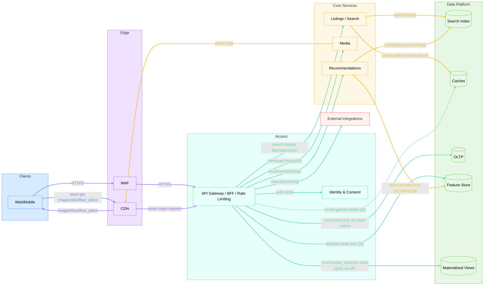
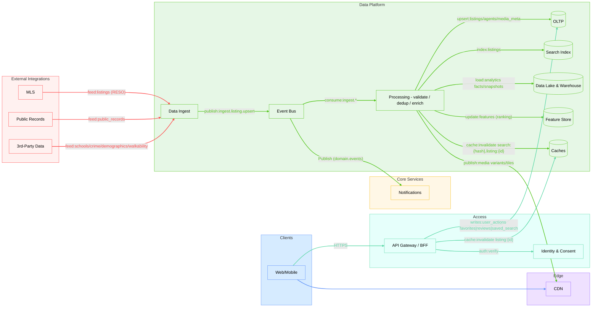
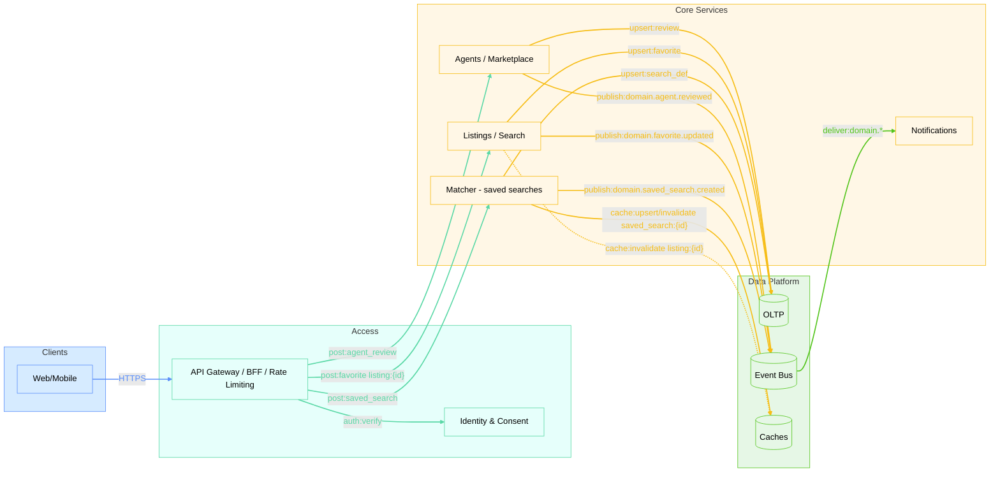
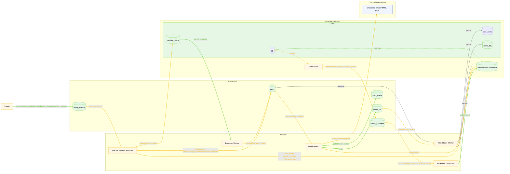
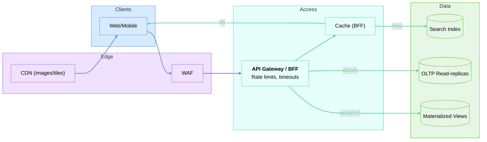

# HomeFinder System Design

## Igor Deriabin

 

1. Intro & Scope
1. Architecture overview — System overview (event bus and MLS ingest)
1. Deep dive — Notifications (EDA, idempotency/dedup, limits)
1. Scaling — Seasonal peaks (caches/CDN, degradation, rate limits)
1. Evolution MVP→v1→v2
1. Summary
1. FAQ

<!--
[Notes ~0:30 | Cumulative ~0:30]
- 00:00–00:10: Short intro, role/context.
- 00:10–00:20: Format: 30 min talk, 30 min Q&A after; stay focused.
- 00:20–00:30: Section plan (see the list on the slide).

Section plan (for myself):
- Mandatory: Intro; Scope; Overview (EDA/MLS‑ingest); Deep dive — Notifications; Scaling — seasonal spikes.
- Optional (if time remains): MVP→v1→v2; Cost optimization; Q&A after the talk.
-->

---
id: 01-intro
time: 1m
---

# 1. Intro + Scope
- Thesis: EDA selectively (fan‑out/decoupling); read path — CQRS/indexes/caches + OLTP replicas/MV; ingress — API Gateway/BFF/rate limits
- Focus scenarios: Search + Property Details; Saved Searches → Alerts; Seasonal Spikes
- What I will prove: why the chosen options beat alternatives; risks and mitigations

- In scope: Web/Mobile, Read Path (Search + Details), Notifications
- Out of scope: Geo distribution deep dive, AR/3D details, MLOps

<!--
[Timing ~1:00]
- 00:00–00:30: Context and meeting goal.
- 00:30–01:15: SLO from task.md: search p95 <200 ms; map <300 ms; images <1 s; valuation <5 s; availability 99.95%; freshness MLS→index 1–3 min.
- 01:15–02:00: What I will show and why: bird’s‑eye → deep dive (Notifications) → scaling; evaluation criteria — clarity of rationale, not completeness.
- 02:00–03:00: Scope In/Out; technology choice (GraphQL optional; BFF+REST/gRPC).

[Script]
- “Hi! I’ll briefly show how we meet HomeFinder’s requirements from task.md.”
- “Targets: search p95<200ms, map <300ms, images <1s, AVM <5s, 99.95% uptime and MLS freshness 1–3 minutes.”
- “Route: architecture overview, then notifications deep‑dive, wrap with scaling under spikes.”
- “Scope: in — Web/Mobile, Read Path and Notifications; out — geo‑distribution deep‑dive, AR/3D, ticketing; GraphQL — optional.”
-->

---
id: 02-overview
time: 4m
---

# 2. Architecture overview — System overview
- Key SLO: search p95 <200 ms; MLS→index freshness <1–3 min
- Note: Kafka where decoupling/fan‑out is needed; REST for synchronous requests
- Stack (at a glance): Node.js (TypeScript) microservices + Kafka event bus + Postgres OLTP + Redis/Elasticsearch caches
- Why this stack: team/candidate expertise + mature managed services; not dogma — adapt under different constraints

---
id: 02a-birds-domain
time: 1m
layout: full
---

## Domains and their roles

```mermaid
%%{init: {
  'themeVariables': { 'fontSize': '12px', 'lineHeight': '1.1' },
  'flowchart': { 'diagramPadding': 4, 'nodeSpacing': 12, 'rankSpacing': 14 }
}}%%
flowchart LR
  CSG[<b>Clients</b><br/>Web, Mobile]
  EG[<b>Edge & Delivery</b><br/>CDN, WAF, TLS, Tiles]
  ACC[<b>Access Layer</b><br/>API Gateway, BFF, REST/GraphQL/gRPC, Rate Limiting]
  CORE[<b>Core Domains</b><br/>Listings/Search/Geo, Agents/Marketplace, Media, AVM, FinServ, Notifications, Recommendations]
  DP[<b>Data Platform</b><br/>Data Ingest, Eventing, Processing, Storage & Indexes, ML Platform, Feature Store]
  XCT[<b>Cross Cutting</b><br/>Observability & SRE, Compliance & Governance]
  EI[<b>External Integrations</b><br>APIs: lenders / credit bureaus / title / maps<br>Feeds: schools / crime / demographics / walkability]

  CSG -- traffic:assets/pages --> EG
  EG -- route:api --> ACC
  ACC -- G→Search/Agents/Media/AVM/Fin/Notif/Reco --> CORE
  ACC -- reads:OLTP,FS --> DP
  CORE -- read:IDX/OLTP/OBJ; events --> DP
  DP -- features/models/events --> CORE
  CORE -- media:images/tiles --> EG
  DP -- origin:media/tiles --> EG
  EI -- APIs --> ACC
  EI -- feeds/ETL --> DP
  XCT -. policy/auth/consent/audit; telemetry .-> ACC
  XCT -. governance/privacy/retention; observability .-> CORE

  class CSG clients;
  class EG edge;
  class ACC access;
  class CORE core;
  class DP platform;
  class XCT cross;
  class EI external;

  classDef clients fill:#D6EBFF,stroke:#5B8FF9,color:#000,stroke-width:1px;
  classDef edge fill:#EFE1FF,stroke:#9A6AFF,color:#000,stroke-width:1px;
  classDef access fill:#E6FFFB,stroke:#5AD8A6,color:#000,stroke-width:1px;
  classDef core fill:#FFF7E6,stroke:#F6BD16,color:#000,stroke-width:1px;
  classDef platform fill:#E6F7E6,stroke:#52C41A,color:#000,stroke-width:1px;
  classDef cross fill:#FFF0F6,stroke:#EB2F96,color:#000,stroke-width:1px;
  classDef external fill:#FFF1F0,stroke:#FF4D4F,color:#000,stroke-width:1px;

  %% edge colors by source domain
  linkStyle 0 stroke:#5B8FF9,color:#5B8FF9,stroke-width:2px
  linkStyle 1 stroke:#9A6AFF,color:#9A6AFF,stroke-width:2px
  linkStyle 2 stroke:#5AD8A6,color:#5AD8A6,stroke-width:2px
  linkStyle 3 stroke:#5AD8A6,color:#5AD8A6,stroke-width:2px
  linkStyle 4 stroke:#F6BD16,color:#F6BD16,stroke-width:2px
  linkStyle 5 stroke:#52C41A,color:#52C41A,stroke-width:2px
  linkStyle 6 stroke:#F6BD16,color:#F6BD16,stroke-width:2px
  linkStyle 7 stroke:#52C41A,color:#52C41A,stroke-width:2px
  linkStyle 8 stroke:#EB2F96,color:#EB2F96,stroke-width:2px
  linkStyle 9 stroke:#EB2F96,color:#EB2F96,stroke-width:2px
```

   

<!--
[Notes ~0:45]
- “What this shows: map of domains and their roles. Top to bottom: Clients → Edge → Access → Core → Data Platform; on the side — Cross‑cutting and External.”
- “Meaning of colors: source of the connection. Helps orient in the next diagrams.”
- “Key: external integrations are a separate domain; cross‑cutting do not call directly — they impose policy/observability.”
- “I will show a detailed services scheme in Docsify; slides focus on user paths.”

[Notes ~0:45]
- “Top to bottom: Edge (WAF/CDN) offloads backend and filters traffic → API Gateway/BFF aggregates for screens.”
- “Core: Listings/Search/Geo, Media, AVM, FinServ, Notifications, Recommendations. Data Platform: indexes, OLTP, Lake/DWH, Feature Store, event bus.”
- “Read Path: fast list/map via indexes/caches; details — OLTP replicas; area analytics — via MV; media — CDN.”
- “Write Path: MLS/Public Records → ingest → events → processing → OLTP/Index/DWH; normalization, dedup, idempotency.”
- “Cross‑cutting: access/consent and observability go across; rate limiting at the edge.”
- “External: maps/lenders isolated by domain — their own SLA/quotas/retries.”
-->

---
id: 02c-read-path
time: 1m
---

## CQRS Read Path

<!--
[Notes ~1:00]
- “Scenario: user applies filters → fast list/map via Index + caches; property details — OLTP read‑replica.”
- “Neighborhood/market analytics: precomputed in MV — fast and no OLTP load.”
- “Media (images/tiles/floor_plans) via CDN; recommendations online (FS+IDX).”
- “External maps/geocoding — separate domain with quotas/retries.”
- “Segue: how data gets into the system — write path.”
-->

---
id: 02d-write-path
time: 1m
---

## Write Path — Ingest, Processing, Indexing

 

<!--
[Notes ~0:45]
- “Sources: MLS/public/3rd‑party (schools/crime/demographics/walkability). Normalization, dedup, idempotency, outbox/CDC — in ingest/processing.”
- “Event bus (Kafka) decouples producers/consumers; processing writes to OLTP/Index/DWH, updates Feature Store and cache invalidations.”
- “Media variants/tiles published to CDN. Domain events trigger notifications.”
- “Risks: data quality, consistency; mitigations: schemas/validations, idempotency, alerts.”
-->

---
id: 02e-user-actions
time: 1m
---

### User Actions — Saved Searches / Favorites / Reviews

  

<!--
[Notes ~0:45]
- “Create saved search: BFF → Matcher → OLTP; event → bus → trigger for notifications.”
- “Favorites: SRCH writes to OLTP, invalidates cache selectively; agent reviews — via AG → OLTP.”
- “Ingress: auth/consent check; affects response fields and channels.”
- “Segue: how notifications are built — next slide (we will detail later).”
-->

---
id: 03-events
time: 10m
---

# 3. Deep dive — Event‑driven notifications

### Topics and keys:
  - saved_searches (key=userId, compact): saved_search.{created|updated|deleted}, user.preferences.updated → state projection
  - domain.listing.events (key=listingId, delete): listing.{created|updated|price_changed|status_changed}
  - alerts (key=userId, delete): alert.created {userId, listingId, matchedSearchIds, dueAt?}
  - alert_status (key=alertId, delete): alert.{delivered|failed|retry|skipped}
  - (opt.) alerts_dlq (key=alertId, delete): quarantine of “poisoned” payloads

---
id: 03a-events
time: 2m
---

# 3. Deep dive — Event‑driven notifications

### Data Flow:

- 1) OLTP → Outbox/CDC → Kafka.saved_searches (userId)
- 2) Projection‑consumer → updates Redis/KTable (saved searches + prefs per userId)
- 3) Ingest → Kafka.listing_events (listingId)
- 4) Matcher: consumess listing.events → looks up saved_search candidates in projection index → fetches prefs from projection (Redis/KTable) → writes alert.created to alerts (key=userId)
- 5) Notifications: consumes alerts → performs delivery → writes alert_status
- 6) Alert Status Worker: consumes alert_status → SETNX/TTL (idempotency, TTL on alertId) + fallback: UPSERT UNIQUE(alertId) in DB

<!--
- Why alerts by userId, not by alert_id:
  - Ordering and rate limits per user; easier coalescing per user
  - alertId in payload/headers; statuses — separate alert_status by alertId
-->

---
id: 03b-events
time: 2m
---

# 3. Deep dive — Event‑driven notifications

### Matching:

- Coarse: fast filtering of saved_search by indexes and geo to discard obviously irrelevant searches
- Exact: for remaining saved_search — exact predicate evaluation (e.g., price range, property attributes)
- matchedSearchIds[] (aggregation): we produce one aggregated notification per user with all matches, not separate notifications per match

<!--
- Rationale — we do not maintain for each listing the list of saved_search, and we do not build an inverted index “listing → saved_search”, because saved_search describes filter conditions rather than a fixed set of listing_id.
- Therefore, when a listing appears/updates we compute on the fly which saved_search it satisfies.
- This approach scales well and keeps user filters independent from listing schema; no excessive recomputation and lower cost of maintaining an inverted index.
-->

---
id: 03c-events
time: 2m
---

# 3. Deep dive — Event‑driven notifications

### Scheduling:

- Real‑time: for immediate alerts alert.created goes to Kafka/alerts‑topic and is processed without delay.
- For digests and delayed alerts we can use one of two approaches:
  - DB scheduler — alert first written only into pending_alerts table with next_send_at; stored reliably until due; periodic worker selects due records and then publishes to Kafka; downstream services consume. (We may build a projection of this state in Redis for fast lookups and throttling, but durable storage is the DB.)
  - Kafka Streams windows (punctuator) — alert.created goes to the topic immediately; streaming app holds within windows until dueAt and then emits.

---
id: 03d-events
time: 2m
---

# 3. Deep dive — Event‑driven notifications

### DLQ and Retry:

- Exponential backoff + jitter, maxAttempts; on exhaustion — write to DLQ topic, a worker persists it to dlq table in DB. A worker periodically either republishes them to Kafka (alerts) or deletes/archives by TTL — per policy.
- Validation errors go to a quarantine topic; a dedicated consumer writes to quarantine table in DB with error details, payload, time and status. Delivery channels are protected with a circuit breaker.
<!--
Quarantine provides fast real‑time signaling via topic and durable storage for investigations via DB — analysis from DB while messages expire in topics by retention/TTL. No auto‑retries for such errors.

Circuit breaker: if quarantine error rate exceeds a threshold, alert delivery is temporarily paused. Consumers check breaker status before sending and skip delivery if the channel is quarantined. TTL is set on alerts.
-->

---
id: 03e-events
time: 2m
---

# 3. Deep dive — Event‑driven notifications

### Idempotency:

- alertId = hash(userId|listingId|matchedSearchIds|eventVersion)
- Before delivery: Redis SETNX(alertId, TTL); fallback UPSERT UNIQUE(alertId) in DB; warm up Redis from DB after failures
- Producers: acks=all, enable.idempotence=true; consumers — manual commit post‑effect

---
id: 03f-events
time: 2m
---

# 3. Deep dive — Event‑driven notifications

<!--
[Notes ~2:00]
- “Goal: alerts for saved searches arrive on time and without duplicates.”
- “Events within a partition (by userId): saved_search.created, saved_search.updated, saved_search.deleted, user.preferences.updated (opt‑in/out, channels). One user may produce several events in a row.”
- “Kafka setup: topic user.actions, 30 partitions by userId (partition key = userId), retention 7 days, cleanup.policy=delete.”
- “Why partitions by userId: strict ordering of a user’s events within a partition. Example: user created a saved search, then updated preferences (disabled email) — Matcher must see the correct order, otherwise we might send an email after opt‑out.”
- “Inbound listing events (listing.created/updated/price_changed) are in a separate topic domain.listing.events (partitions by listingId), Matcher subscribes to both.”
- “Producers: outbox pattern or CDC (Debezium) from OLTP → Kafka; acks=all for reliability; idempotency keys (eventId) in headers for dedup.”
- “Consumers: consumer group for Matcher (multiple instances read different userId partitions); enable.auto.commit=false, manual offset commit after success; at‑least‑once semantics.”
- “Matcher: reads in order, loads current saved searches for userId from cache/OLTP, matches with new listings, checks prefs/consent and rate limits (Redis sliding window per user/channel).”
- “Matching: coarse via index/geo, then exact predicate on normalized saved_search conditions; output matchedSearchIds for userId+listingId.”
- “Idempotency of effects: NOTIF does Redis SETNX(alertId,TTL) and UPSERT in DB with UNIQUE(alertId) before delivery. Redis — fast window and limits, DB — durable source; warm up Redis from DB after failures.”
- “Backpressure: if Matcher lags → consumer pause/resume; if channels overloaded → DLQ and exponential backoff.”
- “Monitoring: consumer lag (<1000 msg), p95 latency event→delivery (<5s), throughput, DLQ size, out‑of‑order events rate (should be 0).”
- “Risks: event storm (spike of user actions or new listings), external channels unavailable, consumer group rebalancing; mitigations: circuit breaker, rate limits, graceful frequency degradation, static membership to reduce rebalance.”
-->

---
id: 04-scaling
time: 4m
---

# 4. Scaling — Seasonal spikes
- Peaks: capacity planning, autoscale, cache warm‑up; tame the tail (timeouts)
- Caching: CDN and BFF response cache; Redis for search results
- Reads: OLTP read‑replicas; materialized views for property details/area metrics
- Reliability: rate limiting, backpressure, circuit breaker, controlled UI degradations
- Cost: hot/warm/cold storage, reserved/spot

<!--
[Notes ~1:00]
- “Spring traffic grows by multiples: pre‑warm caches/CDN.”
- “Tail latency: protect with timeouts and graceful UI degradations (partial responses).”
- “Reads: OLTP read‑replicas and MVs for details/area metrics; facets/indexes — fast aggregations.”
- “Protection: rate limits, backpressure, circuit breaker; for external APIs — quotas and fallbacks.”
- “Cost: hot/warm/cold storage, reserved/spot; target high cache hit rate.”
-->

---
id: 04a-scaling
time: 1m
---
# 4. Scaling — Seasonal spikes

  

<!--
[Notes ~1:00]
- “Peaks: pre‑warm CDN; WAF/GW put limits; BFF cache serves fast hits.”
- “Cache miss — to Search Index; details — from read replicas; area analytics — from MV.”
- “Tail delays — timeouts/backpressure; graceful UI degradations (partial responses).”
-->

---
id: 06-mvp-path
time: 1m
---

# 5. MVP → Modular Monolith → Microservices

- Modular Monolith first: fast delivery, low operational complexity, clear module boundaries
- Strangler Fig: extract hot modules into services as load/teams grow
- When to add Kafka: decoupling producers/consumers, fan‑out of events, fault tolerance; not “everywhere”, only when needed

<!--
[Notes ~1:00]
- “Start with Modular Monolith: fast delivery, low operational overhead, clear module boundaries.”
- “Strangler Fig: as loads/teams grow, extract hot modules into separate services.”
- “Kafka is not everywhere — use where decoupling/fan‑out/retries are needed; synchronous requests — REST/gRPC.”
- “Evolution MVP→v1→v2: from simple to scalable, guided by metrics and audience growth.”
-->

---
id: 05-summary
time: 0.5m
---

# 6. Summary
- Key:
  - Read path: indexes/caches + OLTP replicas/MV keep SLOs (search 200 ms; images <1 s)
  - Write path: ingest→bus→processing ensures MLS freshness (1–3 min), idempotency/dedup
  - Architectural boundaries: domains isolated; cross‑cutting impose policy/observability
- Trade‑offs:
  - Kafka: where fan‑out/decoupling/retries are needed; otherwise — synchronous REST/gRPC
  - GraphQL: optional; BFF + aggregating REST/gRPC cover most screens
  - OLTP vs Lake/DWH: online speed separate from analytics/ML; different SLAs and costs
- Risks → mitigations:
  - Tail latency: timeouts/backpressure, UI degradation, limits
  - External quotas/cost: caching, rate limiting, fallbacks
  - Cache consistency: idempotency, selective invalidations by events
  - Access/privacy: consent checks at ingress, audit, tokenization of PII

<!--
[Notes ~0:45]
- “Recap: reads meet SLOs via indexes/caches and replicas/MV; writes — via bus/processing for freshness and resilience.”
- “Domain boundaries are clear; cross‑cutting impose policy and observability without hard coupling.”
- “Compromises: Kafka — as needed (fan‑out/retries), not everywhere; GraphQL — option, BFF+REST often enough.”
- “Risks: tail, external quotas, cache consistency — we have concrete mitigations.”
- “Happy to discuss alternatives and dive deeper during Q&A.”
-->

---
id: 06-faq
time: 0.5m
---

# 7. FAQ / Expected Q&A
- Kafka vs REST/gRPC: events for decoupling/fan‑out; synchronous for request/response. We do not promise exactly‑once — at‑least‑once + idempotency/outbox.
- Why Node.js: IO‑bound, fast delivery, strong BFF; CPU‑heavy — outside BFF (workers/platform).
- GraphQL? Optional. Aggregating REST/gRPC often suffice; use GraphQL when screens/fields are many and flexibility is needed.
- OLTP vs Lake/DWH: different SLO/cost; decades of history; analytics and training separate from online.
- Cache vs Materialized Views: cache for hot keys/short TTL; MV — stable precomputations for scenarios.
- Read‑replicas vs MV: replicas — point reads/details; MV — neighborhood/market analytics for details.
- Scale to 100M MAU: caches/CDN, indexes, limits, horizontal scale; p95 budgets per layer.
- Contracts: Pact in CI + Schema Registry.

<!--
[Notes ~0:30]
- Keep answers short, refer to slides/sections.
- For deep dives: show the corresponding data flow/diagram in backup.
-->
