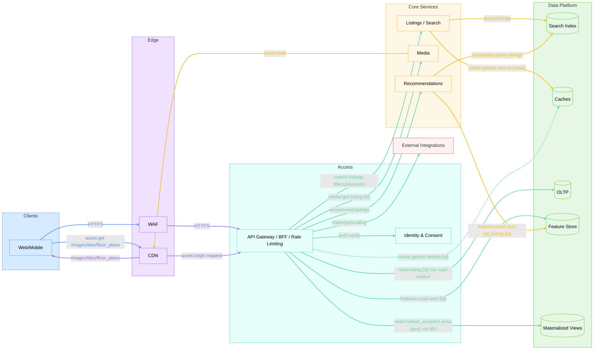
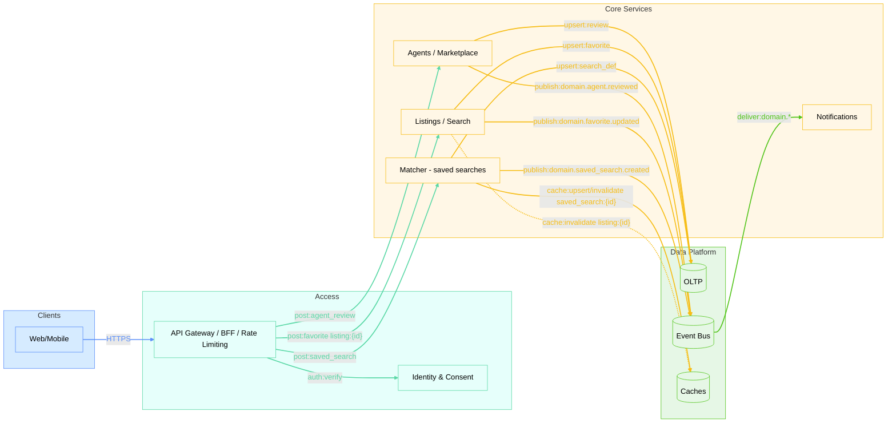
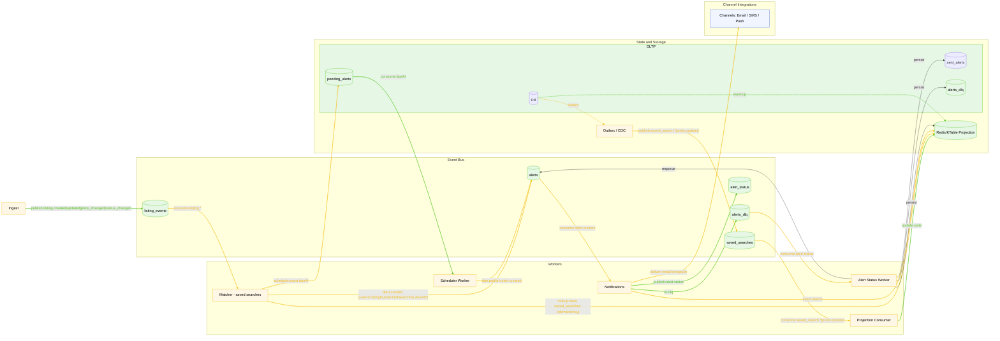
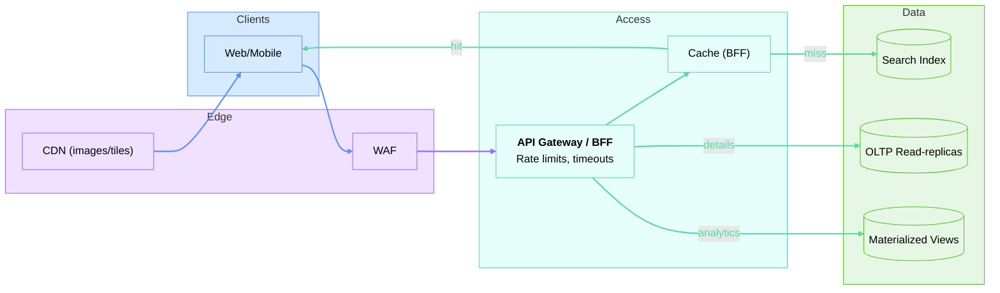

# Системный дизайн HomeFinder

## Igor Deriabin

 

1. Вступление и Scope
1. Обзор архитектуры — System overview (событийная шина и MLS‑ingest)
1. Дип‑дайв — Уведомления (EDA, идемпотентность/дедуп, лимиты)
1. Масштабирование — Сезонные пики (кеши/CDN, деградация, rate limits)
1. Эволюция MVP→v1→v2
1. Итоги
1. FAQ

<!--
[Notes ~0:30 | Cumulative ~0:30]
- 00:00–00:10: Короткое приветствие, роль/контекст.
- 00:10–00:20: Формат: 30 мин доклад, 30 мин Q&A после, держим фокус.
- 00:20–00:30: Повестка по секциям (см. список на слайде).

Секционный план (для себя):
- Обязательная часть: Intro; Scope; Overview (EDA/MLS‑ingest); Deep dive — Notifications; Scaling — seasonal spikes.
- Дополнительно (если останется время): MVP→v1→v2; Cost optimization; Q&A после доклада.
-->

---
id: 01-intro
time: 1m
---

# 1. Вступление + Scope
- Тезис: EDA адресно (фан‑аут/декупляция); read‑path — CQRS/индексы/кэши + OLTP‑реплики/MV; вход — API Gateway/BFF/лимиты
- Сценарии фокуса: Search + Property Details; Saved Searches → Alerts; Seasonal Spikes
- Что докажу: почему выбранные решения лучше альтернатив, риски и митигации

- Внутри: Web/Mobile, Read Path (Search + Details), Notifications
- Вне: Geo distribution deep dive, AR/3D детали, MLOps

<!--
[Хронометраж ~1:00]
- 00:00–00:30: Контекст и цель встречи.
- 00:30–01:15: SLO из task.md: search p95 <200мс; map <300мс; images <1с; valuation <5с; availability 99.95%; свежесть MLS→индекс 1–3 мин.
- 01:15–02:00: Что покажу и почему: bird’s‑eye → deep dive (Notifications) → scaling; критерии оценки — не полнота, а объяснимость решений.
- 02:00–03:00: Scope/In & Out; технический выбор (GraphQL опционален; BFF+REST/gRPC).

[Script]
- «Привет! Я кратко покажу, как закрываем требования HomeFinder из task.md.»
- «Ориентиры: поиск p95<200мс, карта <300мс, фото <1с, AVM <5с, 99.95% аптайм и свежесть MLS 1–3 минуты.»
- «Маршрут: сначала обзор архитектуры, затем дип‑дайв по уведомлениям, и завершим масштабированием под пики.»
- «Scope: внутри — Web/Mobile, Read Path и Notifications; вне — геораспределение deep‑dive, AR/3D, тикеты; GraphQL — по необходимости.»
-->

---
id: 02-overview
time: 4m
---

# 2. Обзор архитектуры — System overview
- Ключевые SLO: поиск p95 <200мс; свежесть MLS→индекс <1–3 мин
- Ремарка: Kafka — там, где нужна декупляция/фан‑аут; REST/gRPC — для синхронных запросов
- Стек (укрупнённо): Node.js (TypeScript) микросервисы + Kafka event bus + Postgres OLTP + Redis/Elasticsearch caches
- Почему такой стек: экспертиза команды/кандидата + зрелые managed‑сервисы; не догма — меняем при других ограничениях

---
id: 02a-birds-domain
time: 1m
layout: full
---

## Домены и их роли

```mermaid
%%{init: {
  'themeVariables': { 'fontSize': '12px', 'lineHeight': '1.1' },
  'flowchart': { 'diagramPadding': 4, 'nodeSpacing': 12, 'rankSpacing': 14 }
}}%%
flowchart LR
  CSG[<b>Clients</b><br/>Web, Mobile]
  EG[<b>Edge & Delivery</b><br/>CDN, WAF, TLS, Tiles]
  ACC[<b>Access Layer</b><br/>API Gateway, BFF, REST/GraphQL/gRPC, Rate Limiting]
  CORE[<b>Core Domains</b><br/>Listings/Search/Geo, Agents/Marketplace, Media, AVM, FinServ, Notifications, Recommendations]
  DP[<b>Data Platform</b><br/>Data Ingest, Eventing, Processing, Storage & Indexes, ML Platform, Feature Store]
  XCT[<b>Cross Cutting</b><br/>Observability & SRE, Compliance & Governance]
  EI[<b>External Integrations</b><br>APIs: lenders / credit bureaus / title / maps<br>Feeds: schools / crime / demographics / walkability]

  CSG -- traffic:assets/pages --> EG
  EG -- route:api --> ACC
  ACC -- G→Search/Agents/Media/AVM/Fin/Notif/Reco --> CORE
  ACC -- reads:OLTP,FS --> DP
  CORE -- read:IDX/OLTP/OBJ; events --> DP
  DP -- features/models/events --> CORE
  CORE -- media:images/tiles --> EG
  DP -- origin:media/tiles --> EG
  EI -- APIs --> ACC
  EI -- feeds/ETL --> DP
  XCT -. policy/auth/consent/audit; telemetry .-> ACC
  XCT -. governance/privacy/retention; observability .-> CORE

  class CSG clients;
  class EG edge;
  class ACC access;
  class CORE core;
  class DP platform;
  class XCT cross;
  class EI external;

  classDef clients fill:#D6EBFF,stroke:#5B8FF9,color:#000,stroke-width:1px;
  classDef edge fill:#EFE1FF,stroke:#9A6AFF,color:#000,stroke-width:1px;
  classDef access fill:#E6FFFB,stroke:#5AD8A6,color:#000,stroke-width:1px;
  classDef core fill:#FFF7E6,stroke:#F6BD16,color:#000,stroke-width:1px;
  classDef platform fill:#E6F7E6,stroke:#52C41A,color:#000,stroke-width:1px;
  classDef cross fill:#FFF0F6,stroke:#EB2F96,color:#000,stroke-width:1px;
  classDef external fill:#FFF1F0,stroke:#FF4D4F,color:#000,stroke-width:1px;

  %% edge colors by source domain
  linkStyle 0 stroke:#5B8FF9,color:#5B8FF9,stroke-width:2px
  linkStyle 1 stroke:#9A6AFF,color:#9A6AFF,stroke-width:2px
  linkStyle 2 stroke:#5AD8A6,color:#5AD8A6,stroke-width:2px
  linkStyle 3 stroke:#5AD8A6,color:#5AD8A6,stroke-width:2px
  linkStyle 4 stroke:#F6BD16,color:#F6BD16,stroke-width:2px
  linkStyle 5 stroke:#52C41A,color:#52C41A,stroke-width:2px
  linkStyle 6 stroke:#F6BD16,color:#F6BD16,stroke-width:2px
  linkStyle 7 stroke:#52C41A,color:#52C41A,stroke-width:2px
  linkStyle 8 stroke:#EB2F96,color:#EB2F96,stroke-width:2px
  linkStyle 9 stroke:#EB2F96,color:#EB2F96,stroke-width:2px
```

   

<!--
[Notes ~0:45]
- «О чем этот слайд: карта доменов и их роли. Сверху вниз: Clients → Edge → Access → Core → Data Platform; сбоку — Cross‑cutting и External.»
- «Смысл цветов: источник связи. Это поможет быстрее ориентироваться на следующих схемах.»
- «Key: внешние интеграции вынесены в отдельный домен, сквозные домены не вызывают напрямую — накладывают политику/наблюдаемость.»
- «Детальную схему с сервисами покажу в Docsify; в слайдах — пользовательские пути.»

[Notes ~0:45]
- «Сверху вниз: Edge (WAF/CDN) разгружает бекенд и фильтрует трафик → API Gateway/BFF агрегирует ответы для экранов.»
- «Core: Listings/Search/Geo, Media, AVM, FinServ, Notifications, Recommendations. Data Platform: индексы, OLTP, Lake/DWH, Feature Store, шина событий.»
- «Read Path: быстрый поиск/карта через индексы/кэши; детали карточки — из OLTP‑реплик; районная аналитика — через MV; медиа — CDN.»
- «Write Path: MLS/Public Records → ingest → события → обработка → OLTP/Index/DWH; нормализация, дедуп, идемпотентность.»
- «Cross‑cutting: доступ/согласия и наблюдаемость идут сквозно; на входе — rate limiting.»
- «External: карты/кредиторы изолированы доменом — свои SLA/квоты/ретраи.»
-->

---
id: 02c-read-path
time: 1m
---

## CQRS Read Path

<!--
[Notes ~1:00]
- «Сценарий: пользователь вводит фильтры → быстрый список/карта через Index + кэши; детали объекта — OLTP read‑replica»
- «Район/market analytics: предвычислено в MV — быстро и без нагрузки на OLTP»
- «Медиа (images/tiles/floor_plans) через CDN; рекомендации подключаются онлайн (FS+IDX)»
- «Внешние карты/геокодинг — отдельный домен, с квотами/ретраями»
- «Переход: как эти данные попадают в систему — write path»
-->

---
id: 02d-write-path
time: 1m
---

## Write Path — Ingest, Processing, Indexing

```mermaid
flowchart LR
  subgraph XCT [External Integrations]
    direction TB
    MLS[MLS]
    PR[Public Records]
    TP[3rd‑Party Data]
  end

  subgraph DP [Data Platform]
    direction LR
    IN[Data Ingest]
    BUS[Event Bus]
    PROC[Processing - validate / dedup / enrich]
    OLTP[(OLTP)]
    IDX[(Search Index)]
    DWH[(Data Lake & Warehouse)]
    FS[(Feature Store)]
    CACHE[(Caches)]
  end

  subgraph EG [Edge]
    direction TB
    CDN[CDN]
  end

  subgraph CORE [Core Services]
    direction TB
    NOTIF[Notifications]
  end

  MLS -- feed:listings (RESO) --> IN
  PR -- feed:public_records --> IN
  TP -- feed:schools/crime/demographics/walkability --> IN
  IN -- publish:ingest.listing.upsert --> BUS
  BUS -- consume:ingest.* --> PROC
  PROC -- upsert:listings/agents/media_meta --> OLTP
  PROC -- index:listings --> IDX
  PROC -- load:analytics facts/snapshots --> DWH
  PROC -- update:features (ranking) --> FS
  PROC -- cache:invalidate search:{hash},listing:{id} --> CACHE
  PROC -- publish:media variants/tiles --> CDN
  BUS -- Publish (domain.events) --> NOTIF

  %% Client-originated writes (summary)
  subgraph ACC [Access]
    direction TB
    G[API Gateway / BFF]
    AUTH[Identity & Consent]
  end
  subgraph CSG [Clients]
    direction TB
    WEB[Web/Mobile]
  end
  CDN --> WEB
  WEB -- HTTPS --> G
  G -- auth:verify --> AUTH
  G -- writes:user_actions favorites|reviews|saved_search --> OLTP
  G -- cache:invalidate listing:{id} --> CACHE

  class MLS,PR,TP external; class IN,BUS,PROC,OLTP,IDX,DWH,FS,CACHE platform; class CDN edge; class NOTIF core; class WEB clients; class G,AUTH access;
  style DP fill:#E6F7E6,stroke:#52C41A,stroke-width:1px,color:#333
  style EG fill:#EFE1FF,stroke:#9A6AFF,stroke-width:1px,color:#333
  style CORE fill:#FFF7E6,stroke:#F6BD16,stroke-width:1px,color:#333
  style XCT fill:#FFF1F0,stroke:#FF4D4F,stroke-width:1px,color:#333
  style CSG fill:#D6EBFF,stroke:#5B8FF9,stroke-width:1px,color:#333
  style ACC fill:#E6FFFB,stroke:#5AD8A6,stroke-width:1px,color:#333
  classDef platform fill:#E6F7E6,stroke:#52C41A,color:#000,stroke-width:1px;
  classDef edge fill:#EFE1FF,stroke:#9A6AFF,color:#000,stroke-width:1px;
  classDef core fill:#FFF7E6,stroke:#F6BD16,color:#000,stroke-width:1px;
  classDef external fill:#FFF1F0,stroke:#FF4D4F,color:#000,stroke-width:1px;
  classDef clients fill:#D6EBFF,stroke:#5B8FF9,color:#000,stroke-width:1px;
  classDef access fill:#E6FFFB,stroke:#5AD8A6,color:#000,stroke-width:1px;

  linkStyle 0 stroke:#FF4D4F,color:#FF4D4F,stroke-width:2px
  linkStyle 1 stroke:#FF4D4F,color:#FF4D4F,stroke-width:2px
  linkStyle 2 stroke:#FF4D4F,color:#FF4D4F,stroke-width:2px
  linkStyle 3 stroke:#52C41A,color:#52C41A,stroke-width:2px
  linkStyle 4 stroke:#52C41A,color:#52C41A,stroke-width:2px
  linkStyle 5 stroke:#52C41A,color:#52C41A,stroke-width:2px
  linkStyle 6 stroke:#52C41A,color:#52C41A,stroke-width:2px
  linkStyle 7 stroke:#52C41A,color:#52C41A,stroke-width:2px
  linkStyle 8 stroke:#52C41A,color:#52C41A,stroke-width:2px
  linkStyle 9 stroke:#52C41A,color:#52C41A,stroke-width:2px
  linkStyle 10 stroke:#52C41A,color:#52C41A,stroke-width:2px
  linkStyle 11 stroke:#52C41A,color:#52C41A,stroke-width:2px
  linkStyle 12 stroke:#5B8FF9,color:#5B8FF9,stroke-width:2px
  linkStyle 13 stroke:#5AD8A6,color:#5AD8A6,stroke-width:2px
  linkStyle 14 stroke:#5AD8A6,color:#5AD8A6,stroke-width:2px
  linkStyle 15 stroke:#5AD8A6,color:#5AD8A6,stroke-width:2px
  linkStyle 16 stroke:#5AD8A6,color:#5AD8A6,stroke-width:2px
```

 

<!--
[Notes ~0:45]
- «Источники: MLS/публичные/3rd‑party (schools/crime/demographics/walkability). Нормализация, дедуп, idempotency, outbox/CDC — в ingest/processing.»
- «Шина (Kafka) декуплирует продюсеров/консьюмеров; обработка пишет в OLTP/Index/DWH, обновляет Feature Store и инвалидации кэшей.»
- «Медиа‑варианты/тайлы публикуем в CDN. Доменные события запускают уведомления.»
- «Риски: качество данных, консистентность; митигации: схемы/валидации, идемпотентность, алерты.»
-->

---
id: 02e-user-actions
time: 1m
---

### User Actions — Saved Searches / Favorites / Reviews

  

<!--
[Notes ~0:45]
- «Создание сохранённого поиска: BFF → Matcher → OLTP; событие → шина → триггер для уведомлений»
- «Избранное: SRCH пишет в OLTP, адресно инвалидирует кэш; отзывы агентов — через AG → OLTP»
- «Вход: проверяем auth/consent, это влияет на поля ответа и каналы коммуникаций»
- «Переход: как строятся уведомления внутри — следующий слайд (дополнительно рассмотрим позже)»
-->

---
id: 03-events
time: 10m
---

# 3. Дип‑дайв — Event‑driven уведомления

- Топики и ключи:
  - saved_searches (key=userId, compact): saved_search.{created|updated|deleted}, user.preferences.updated → проекция состояния
  - domain.listing.events (key=listingId, delete): listing.{created|updated|price_changed|status_changed}
  - alerts (key=userId, delete): alert.created {userId, listingId, matchedSearchIds, dueAt?}
  - alert_status (key=alertId, delete): alert.{delivered|failed|retry|skipped}
  - (опц.) alerts_dlq (key=alertId, delete): quarantine «ядовитых» записей

---
id: 03a-events
time: 2m
---

# 3. Дип‑дайв — Event‑driven уведомления

### Data Flow:

- 1) OLTP → Outbox/CDC → Kafka.saved_searches (userId)
- 2) Projection‑consumer → обновляет Redis/KTable (saved searches + prefs по userId)
- 3) Ingest → Kafka.listing_events (listingId)
- 4) Matcher: consume listing.events → ищет кандидаты saved_search в projection индексе → подтягивает prefs из проекции (Redis/KTable) → пишет alert.created в alerts (key=userId)
- 5) Notifications: consume alerts → отправка → пишет alert_status
- 6) Alert Status Worker: consume alert_status → SETNX/TTL (идемпотентность, TTL на alertId) + fallback: UPSERT UNIQUE(alertId) в БД

<!--
- Почему alerts по userId, а не по alert_id:
  - Порядок и rate limits per user; удобный коалесинг по пользователю
  - alertId в payload/headers; статусы — в отдельном alert_status по alertId
-->

---
id: 03b-events
time: 2m
---

# 3. Дип‑дайв — Event‑driven уведомления

### Matching:

- Coarse: сначала быстрая фильтрация saved_search по индексам и гео-признакам (чтобы отсечь заведомо нерелевантные поиски)
- Exact: затем для оставшихся saved_search — точная проверка условий предикатом (например, диапазон цены, параметры объекта)
- matchedSearchIds[] (агрегация): в результате собирается массив ID совпавших сохранённых поисков — пользователю отправляется одно агрегированное уведомление, а не отдельное для каждого совпадения

<!--
- Суть подхода — мы не храним для каждого listing список saved_search, и не строим обратный индекс "listing → saved_search", потому что saved_search описывает условия подбора (фильтры пользователя), а не хранит конкретные listing_id.
- Поэтому при появлении/обновлении listing мы на лету вычисляем, каким saved_search он подходит (фильтруем по условиям).
- Такой подход проще масштабировать и он обеспечивает независимость пользовательских фильтров от структуры листингов — нет избыточных пересчётов и высокой стоимости поддержки обратного индекса.
-->

---
id: 03c-events
time: 2m
---

# 3. Дип‑дайв — Event‑driven уведомления

### Scheduling:

- Реал‑тайм: для мгновенных алертов alert.created сразу отправляется в Kafka/alerts-topic и обрабатывается без задержки.
- Для дайджестов и отложенных алертов можем применить один из двух подходов:
  - DB scheduler — alert сначала пишется только в таблицу pending_alerts в БД c полем next_send_at, надёжно хранится там до наступления времени отправки; периодический worker выбирает «созревшие» записи и только тогда паблишит в Kafka, после чего алерт консумится downstream‑сервисами. (Для быстрого lookup и throttle лимитов можно строить проекцию этого состояния в Redis, но durable storage — только БД).
  - Kafka Streams windows (punctuator) — alert.created сразу кладётся в топик; потоковое приложение держит их внутри окон до dueAt и пускает дальше только «созревшие» алерты.

---
id: 03d-events
time: 2m
---

# 3. Дип‑дайв — Event‑driven уведомления

### DLQ and Retry:

- Экспоненциальный backoff + jitter, maxAttempts; при исчерпании попыток — событие кладём в DLQ‑топик, откуда воркер перекладывает в dlq-таблицу в БД. Отдельный воркер периодически либо репаблишит их в Kafka (в alerts), либо удаляет/архивирует по TTL — по политике.
- Валидационные ошибки попадают в quarantine-topic, откуда специальный консюмер записывает их в отдельную таблицу quarantine в БД с деталями ошибки, payload, временем и статусом.  Канал доставки алертов защищён circuit breaker’ом.
<!--
Карантин даёт быстрый real-time алерт через топик и надёжное долговременное хранение для расследований — анализ производится по БД, а из топика события исчезают по retention/TTL. Для таких ошибок автоповторы не используются.

Circuit Breaker: если поток quarantine-ошибок превышает заданный порог, отправка алертов временно приостанавливается. Консюмеры перед отправкой проверяют статус circuit breaker для этого канала и не отправляют алерты, если канал в карантине. Для quarantine-алертов выставляется TTL.
-->

---
id: 03e-events
time: 2m
---

# 3. Дип‑дайв — Event‑driven уведомления

### Idempotency:

- alertId = hash(userId|listingId|matchedSearchIds|eventVersion)
- Перед отправкой: Redis SETNX(alertId, TTL); fallback UPSERT UNIQUE(alertId) в БД; Redis прогреваем из БД при падении
- Producers: acks=all, enable.idempotence=true; consumers — manual commit post‑effect

---
id: 03f-events
time: 2m
---

# 3. Дип‑дайв — Event‑driven уведомления

<!--
[Notes ~2:00]
- «Цель: алерты по сохранённым поискам приходят своевременно и без дублей.»
- «События в партиции (по userId): saved_search.created, saved_search.updated, saved_search.deleted, user.preferences.updated (opt-in/out, channels). Один юзер может генерировать несколько событий подряд.»
- «Kafka setup: топик user.actions, 30 партиций по userId (partition key = userId), retention 7 дней, cleanup.policy=delete.»
- «Зачем партиции по userId: строгий порядок событий для одного юзера внутри партиции. Пример: юзер создал сохранённый поиск, затем обновил preferences (отключил email) — Matcher должен увидеть их в правильном порядке, иначе отправим email уже после opt-out.»
- «Входящие события о листингах (listing.created/updated/price_changed) идут в отдельный топик domain.listing.events (партиции по listingId), Matcher подписан на оба топика.»
- «Продюсеры: outbox pattern или CDC (Debezium) из OLTP → Kafka; acks=all для надёжности; ключи идемпотентности (eventId) в headers для дедупа.»
- «Консьюмеры: consumer group для Matcher (несколько инстансов читают разные партиции userId); enable.auto.commit=false, manual offset commit после успешной обработки; at‑least‑once семантика.»
- «Matcher: читает события в порядке, загружает актуальные saved searches для userId из кэша/OLTP, сопоставляет с новыми листингами, проверяет prefs/consent и rate limits (Redis sliding window per user/channel).»
- «Матчинг: грубая фильтрация через индекс и гео, затем точный предикат по нормализованным условиям saved_search; на выходе matchedSearchIds для пары userId и listingId.»
- «Идемпотентность эффектов: NOTIF перед отправкой делает Redis SETNX(alertId,TTL) и UPSERT в БД с UNIQUE(alertId). Redis — быстрое окно и rate limits, БД — durable источник; при падении Redis восстанавливаем из БД.»
- «Backpressure: если Matcher отстаёт → пауза консьюмера (pause/resume API); если каналы перегружены → DLQ и экспоненциальный бэк‑офф.»
- «Мониторинг: consumer lag (<1000 msg), p95 latency event→delivery (<5s), throughput, DLQ размер, rate of out-of-order events (должен быть 0).»
- «Риски: шторм событий (spike user actions или новых листингов), внешние каналы недоступны, rebalancing consumer group; митигации: circuit breaker на каналы, rate limits, graceful деградация частоты, static membership для уменьшения rebalance.»
-->

---
id: 04-scaling
time: 4m
---

# 4. Масштабирование — Seasonal spikes
- Пики: capacity план, автоскейл, прогрев кэшей; боремся с хвостом (таймауты)
- Кэширование: CDN и BFF‑кэш ответов; Redis для search‑результатов
- Чтения: read‑реплики OLTP; materialized views под карточки/районные метрики
- Защита: rate limiting, load shedding, контролируемая деградация UI
- Стоимость: hot/warm/cold storage, reserved/spot

<!--
[Notes ~1:00]
- «Весной трафик растёт кратно: планируем ёмкость и греем кэши/CDN заранее.»
- «Хвостовая латентность: ограничиваем таймаутами и грациозными деградациями UI (частичные ответы).»
- «Чтения: read‑реплики OLTP и MV под карточки/районные метрики; фасеты/индексы — быстрые агрегации.»
- «Защита: rate limiting, backpressure, circuit breaker; для внешних API — квоты и фоллбэки.»
- «Стоимость: hot/warm/cold хранение, reserved/spot; целимся в высокий hit‑rate кэшей.»
-->

---
id: 04a-scaling
time: 1m
---

# 4. Масштабирование — Seasonal spikes

  

<!--
[Notes ~1:00]
- «Пики: CDN греем заранее; WAF/GW ставят лимиты; BFF‑кэш даёт быстрые хиты.»
- «Мисс по кэшу — в Search Index; карточки — из read‑реплик; районная аналитика — из MV.»
- «Хвостовые задержки — timeouts/backpressure; graceful деградации UI (partial responses).»
-->

---
id: 06-mvp-path
time: 1m
---

# 5. MVP → Modular Monolith → Microservices

- Modular Monolith сначала: быстрый delivery, низкая операционная сложность, чёткие границы модулей
- Strangler Fig: выделяем горячие модули в отдельные сервисы по мере роста нагрузки/команд
- Когда добавлять Kafka: декупляция производителей/потребителей, фан‑аут событий, fault‑tolerance; не «везде», а по необходимости

<!--
[Notes ~1:00]
- «Начинаем с Modular Monolith: быстро доставляем фичи, низкая операционная сложность, границы модулей чёткие.»
- «Strangler Fig: по мере роста нагрузки/команды выделяем горячие модули в отдельные сервисы.»
- «Kafka добавляем не везде, а там, где нужны декупляция/фан‑аут/ретраи; синхронные запросы — REST/gRPC.»
- «Эволюция MVP→v1→v2: от простого к масштабируемому, ориентируясь на метрики и рост аудитории.»
-->

---
id: 05-summary
time: 0.5m
---

# 6. Итоги
- Ключевое:
  - Read‑path: индексы/кэши + OLTP‑реплики/MV держат SLO (search 200мс; images <1с)
  - Write‑path: ingest→bus→processing обеспечивает свежесть MLS (1–3 мин), идемпотентность/дедуп
  - Архитектурные границы: домены изолированы; cross‑cutting накладывают политику/наблюдаемость
- Trade‑offs:
  - Kafka: там, где нужен фан‑аут/декупляция/ретраи; иначе — синхронный REST/gRPC
  - GraphQL: опционально; BFF + агрегирующие REST/gRPC покрывают большинство экранов
  - OLTP vs Lake/DWH: скорость онлайна отдельно от аналитики/ML; разные SLA и стоимость
- Риски → митигации:
  - Хвостовая латентность: timeouts/backpressure, деградации UI, лимиты
  - Внешние квоты/стоимость: кэширование, rate limiting, фоллбэки
  - Консистентность кэшей: идемпотентность, селективные инвалидации по событиям
  - Доступы/приватность: consent‑checks на входе, аудит, токенизация PII

<!--
[Notes ~0:45]
- «Резюмирую: на чтении SLO закрываются индексами/кэшами и репликами/MV; на записи — шина/обработка дают свежесть и устойчивость»
- «Границы доменов прозрачные; сквозные — политика и наблюдаемость без жёстких связей»
- «Компромиссы: Kafka — по необходимости (фан‑аут/ретраи), не везде; GraphQL — опция, BFF+REST хватает чаще»
- «Риски: хвост, квоты внешних, консистентность кэшей — у нас есть конкретные митигации»
- «Готов обсудить альтернативы и углубиться в интересующие части на Q&A»
-->

---
id: 06-faq
time: 0.5m
---

# 7. FAQ / Expected Q&A
- Kafka vs REST/gRPC: события для декупляции/фан‑аута; синхрон — для запрос/ответ. Exactly‑once не обещаем — at‑least‑once + идемпотентность/outbox.
- Почему Node.js: IO‑bound, быстрый delivery, сильный BFF; CPU‑тяжёлое — вне BFF (воркеры/платформа).
- GraphQL? Опционально. Достаточно агрегирующих REST/gRPC; GraphQL когда экранов/полей много и требуется гибкость.
- OLTP vs Lake/DWH: разные SLO/стоимость; 30+ лет истории; аналитика и обучение отделены от онлайна.
- Cache vs Materialized Views: кэш для горячих ключей/короткой жизни; MV — стабильные предвычисления под сценарии.
- Read‑replicas vs MV: реплики — point‑reads/детали; MV — районная/рыночная аналитика для карточек.
- Масштаб 100M MAU: кэши/CDN, индексы, лимиты, горизонтальный скейл; p95 бюджеты по слоям.
- Контракты: Pact в CI + Schema Registry.

<!--
[Notes ~0:30]
- Держать ответы предельно короткими и с отсылкой на слайды/разделы.
- При глубоком нырянии: показать соответствующий data flow/диаграмму в backup.
-->
